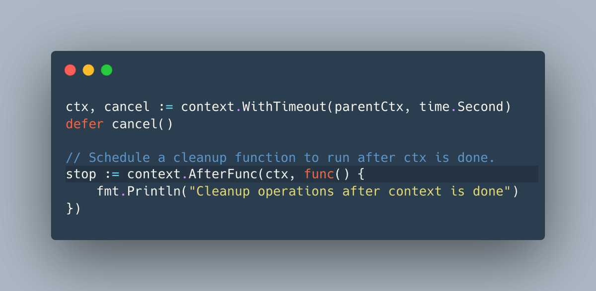
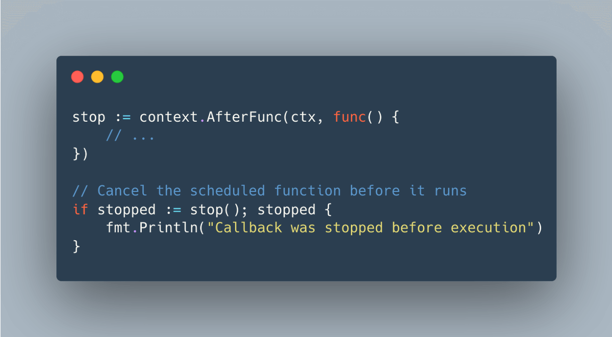

# Tip #31 在上下文取消后使用`context.AfterFunc`来执行调度函数

> 原始链接: [Golang Tip #32: Scheduling functions after context cancellation with context.AfterFunc](https://twitter.com/func25/status/1762087461839364445)
>

在 [tip #30](https://colobu.com/gotips/030.html)，我们学习了如何使一个Context在其Context停止时仍能继续运行：

现在，让我们来看一下`Go 1.21`引入的一项新特性。

`context.AfterFunc`允许您设置一个回调函数`f`，在ctx结束后（无论因取消还是超时）在新的goroutine中运行。

该特性对于清理、日志记录或其他取消后的任务非常有用。

> “回调函数何时运行？”

回调函数在一个新的goroutine中运行，该goroutine在接收到父级上下文的ctx.done通道发送的信号后被触发。

> “如果上下文已经取消了怎么办？”

回调函数会立即运行，当然也是在一个新的`goroutine`中。

以下是几个要点：

- 自行运行：您可以多次使用同一上下文调用`AfterFunc`而没有任何问题，您设置的每个任务都会各自独立运行。
- 如果上下文已完成则立即运行：如果在调用`AfterFunc`时`ctx`已结束，则它会立即在一个新的goroutine中启动`f`。
- 可以取消计划中的函数：它为您提供了一个`stop`函数，可以阻止f运行。
- 非阻塞：使用`stop`不会等待f完成，而是快速停止。如果您需要f和主线程工作保持同步，需要您自行安排。
接下来我们谈谈AfterFunc返回的stop()函数：

如果我们尚未完成上下文且回调尚未运行（实际上，goroutine尚未被触发）时就调用stop()，那么stopped将为true。

这意味着我们成功阻止了回调的运行。

如果stop()返回false，则可能意味着：
- 函数f已在新的goroutine中开始运行。
- 函数`f`已被停止。