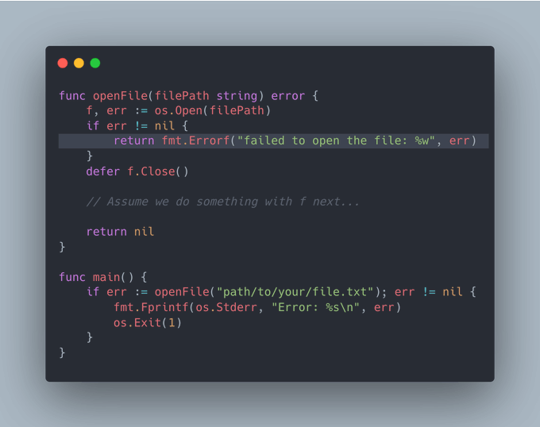

# Tip #33 尽量...不要使用panic()
>  原始链接：[Golang Tip #33: Just... Don’t Panic()](https://twitter.com/func25/status/1762455704903029138)
>
“不要使用panic()”这句话听起来很激进，但实际上是在生产环境中应遵循的良好实践。

“为何这么说？难道我不能利用recover()来捕获panic()吗？”

即使你使用了recover(),也可能无法从panic()中恢复。下面我来解释一下：

(我之前在这篇[推文](https://twitter.com/func25/status/1735369960434831629)也已稍微解释过)

在上面的代码片段中，panic是在一个新的goroutine中发生的（通过go panicFunc启动）。

关键是，只有panic触发和调用recover()是在同一个goroutine中时，使用recover()才有效。

因此，在主函数中的defer函数无法捕获或恢复panic，尽管尝试了恢复，程序仍然会崩溃。

但这并不是唯一的原因，还有另外两点考量：

1. **在生产环境中，代码必须具备极高的稳健性**
程序意外崩溃是绝对要避免的，因为它会导致系统宕机，从而影响用户体验，并可能对您的企业声誉造成不利影响。

1. **系统中某一部分的panic可能会引发连锁反应**
这可能导致系统（尤其是在微服务或者分布式系统）中其他部分接连出现故障（可能是级联失败）。

我们来看一个典型例子：

上面这种做法并非不可取，但它们鼓励了对panic的使用。一个更佳的做法应该如下：

当程序返回错误而非panic时，你的程序可以根据错误做进行相应的处理，例如：

* 重试操作
* 使用默认值
* 记录详细的调试信息
* 程序终止
* 等等...

这种灵活性对于构建健壮的系统至关重要。

**应当把panic作为最后的手段**

* 仅在遇到真正无法恢复的错误时才使用panic，即如果继续运行程序可能会引发更严重的问题，比如数据损坏或未知行为。
* 在程序初始化阶段，如果一个关键组件启动失败，panic或许是“可接受的”，因为它表明程序无法按预期运行。
