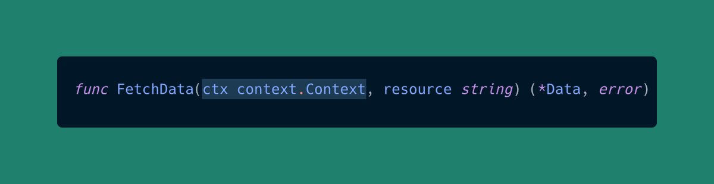
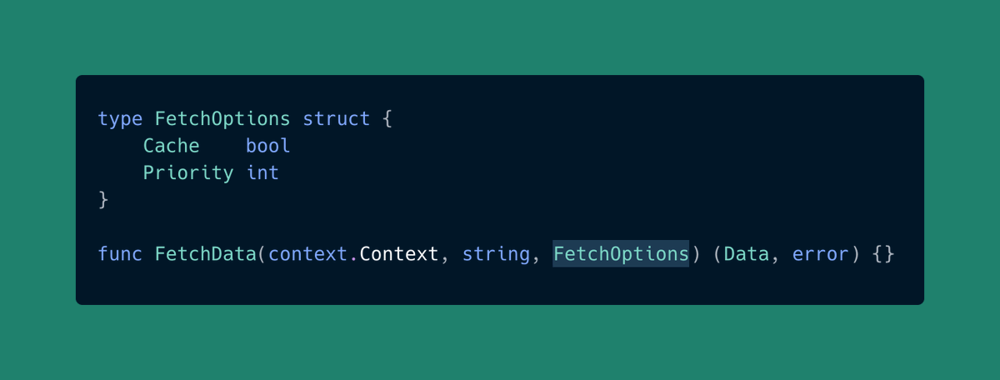
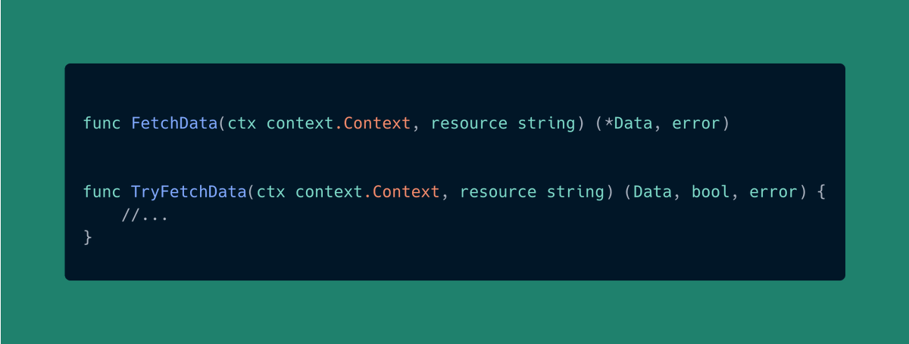

# Tip #34 以 context 开头，以 options 结尾，并且总是用 error 来关闭

> 原始链接：[Golang Tips #34: Lead with context, end with options, and always close with an error](https://twitter.com/func25/status/1762798519696732567)

编写符合习惯的 Go 代码通常涉及遵循一定的模式和最佳实践，这些模式和实践能够提升代码的可预测性。

这里是 3 个设计函数签名时的关键准则：

1. `context.Context` 放在前面

在函数签名中，`context.Context` 应当始终放在首位。

> “为什么？”

**context 通常与一个请求或者操作的生命周期息息相关。**

当浏览代码时，一看到 `context.Context` 作为第一个参数，就立刻让人明白这个函数有如下的特性：

- 取消
- 截止期限
- 其他上下文相关的机制

这种一致性有助于提高代码的**可读性**，并且让代码库变得易于导览。

此外，别把 `context.Context` 放到 struct 中。

context 本质上意味着它注定是短暂的，旨在贯穿与一段程序，而非成为一个对象状态的一部分（这里有一些例外情况，比如，HTTP 的 handler，大家习以为常地从请求中提取 context，这是因为这里 context 早已跟请求的生命周期关联起来了）。

2. Options 结构体置于最后

“options 结构体” 模式是一个灵活而强大的方法，它能让函数在不破坏兼容性的前提下随着时间去演进。

我曾在推特上探讨过 options 结构体和可变参 options：<https://twitter.com/func25/status/1758435261183353308>

参数的顺序可能表征了这个参数的重要性。

把这个结构体作为一个函数的最后一个参数有两个目的：

- 保持一致性（与可变参 options 模式一致）
- 表明这些是可选配置项，而非函数操作逻辑的核心部分

3. 以 `error`（或者 `bool`）结尾

Go 在语义上表征一个操作是成功还是失败是通过它的最后一个返回值来达成的，通常这个最后的返回值是一个 `error`。

某些情况中，如果布尔值更加妥当，比如说存在性检查，那么它也是放到最后的。

如果兼而有之，那么优先级应当是 `(x, bool, error)`。

在譬如 `TryFetchData` 的场景中，`bool` 被用来表征存在性，特别是即便不存在也不被当做是一个错误的情况下。
