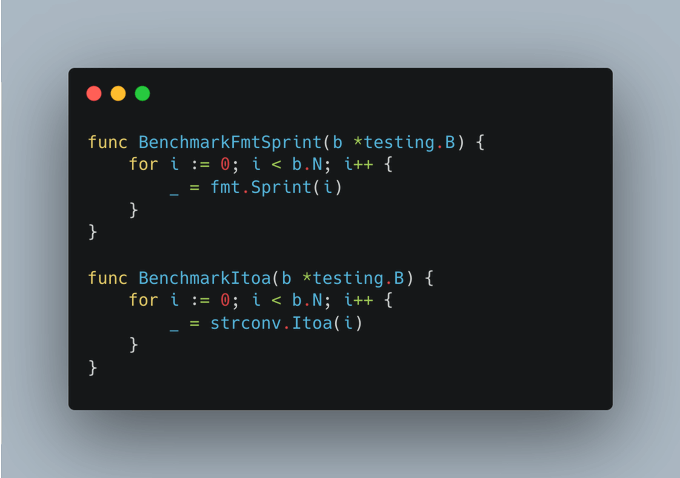
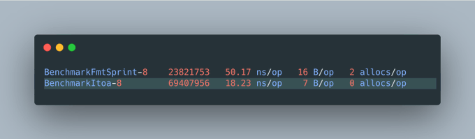
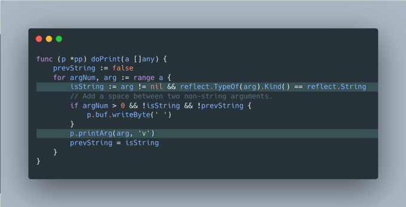

# Tip #35 转换字符串时优先使用 `strconv` 而非 `fmt`

> 原始链接：[Golang Tip #35: Prefer strconv over fmt for converting to/from string.](https://twitter.com/func25/status/1763187911942660330)

当需要将数字转换为字符串时，选择合适的工具可以加快处理速度。

**`strconv`** 包专门为这个场景而设计，每一点性能提升和内存节省都很重要。

我们来看一个简单的基准测试：

基准测试显示出显着的性能差异。

_（虽然我不确定编译器是否做了优化，但两者的上下文是相同的）_

- **`strconv`** 的函数是为特定的转换任务设计的，这使得它们能比更通用的 **`fmt`** 函数执行得更快。
- **`fmt.Sprint`** 函数及其变体需要通过反射来识别其正在处理的类型，并确定如何将其格式化为字符串。

这个反射过程并非无成本，它既增加了时间也增加了内存开销。
