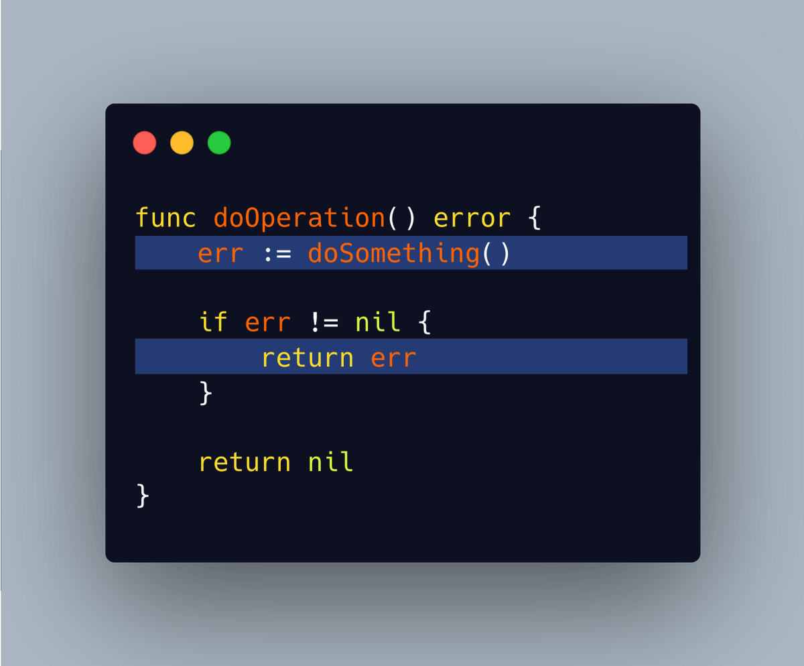
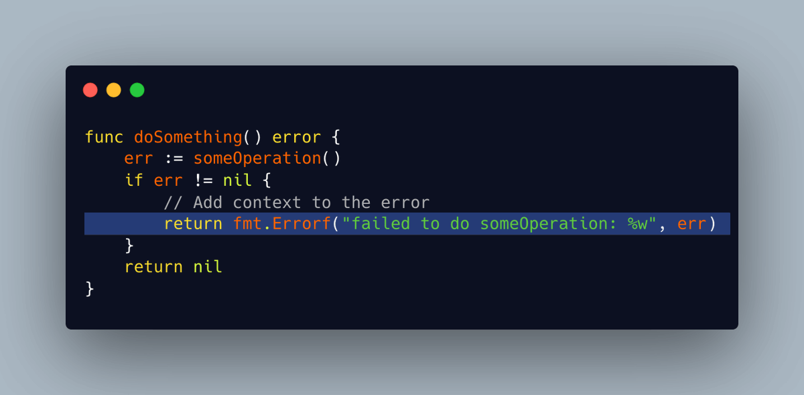
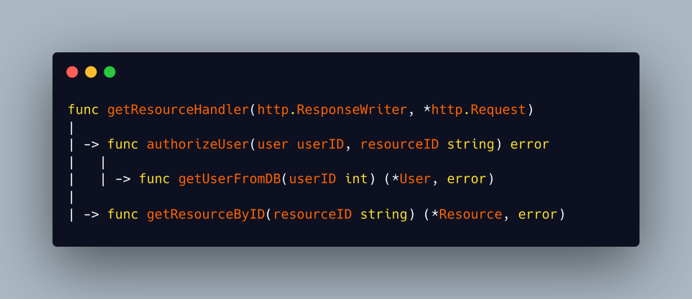
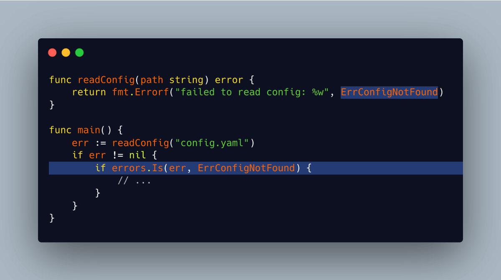

# Tip #38 使用 fmt.Errorf 使你的错误信息清晰明了，不要让它们过于赤裸

> 原始链接：[Golang Tip #38: Make your errors clear with fmt.Errorf, don't just leave them bare.](https://twitter.com/func25/status/1764265328165753176)

在 Go 语言中，错误被当成值来处理。我们采用返回错误而非抛出错误的方式：

仅返回错误而不提供任何额外详情会导致难以确定错误来源及为何发生。

这会使调试错误和处理错误变得更加困难。

**使用 `fmt.Errorf` 和 `%w` **

Go 1.13 版本引入了一种在保留原始错误的同时为其添加更多信息的方法，这就是通过 `fmt.Errorf` 函数配合 `%w` 符号来实现。

它会将错误包装起来，以便您在后续需要时能够深入探究：

> “我还是没看出这样做的好处，反正最后都只是一个错误。”

让我们通过一个例子来看看添加详细信息的重要性：

下面哪一项提供了更多信息？

- "Failed to retrieve resource: Authorization check failed: User 123 does not exist: mongo: no documents in result"
- "Failed to retrieve resource: mongo: no documents in result"

第一种表述清楚地显示出问题起始于一个不存在的用户，导致了操作失败。而第二种错误信息则未能帮助我们判断问题根源是在用户还是资源上。

如果没有这些细节信息，我们可能会错过关于到底哪里出错的重要线索。

另外，通过使用 `errors.Is()` 方法，我们可以精准地定位错误的确切类型：

> @thedenisnikulin 提供了额外的建议，我们可以进一步改进错误处理方式。
>
> "failed to do X: %w" is bad when you have deeply wrapped errors
> better write "doing X: %w"
