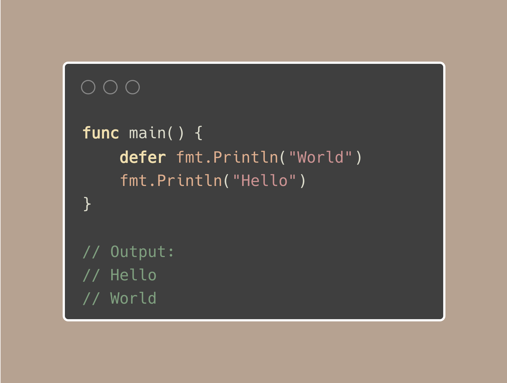
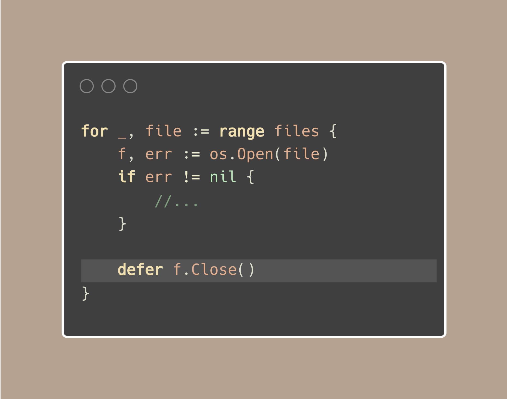
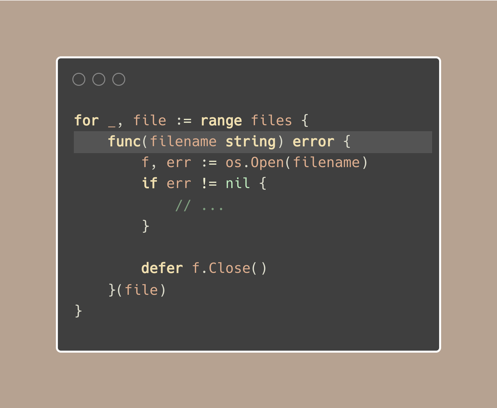

# Tip #39 避免在循环中使用defer，否则可能会导致内存溢出

>  原始链接：[Golang Tip #39: Avoid defer in loops, or your memory might blow up.](https://twitter.com/func25/status/1764606374519230540)

在 Go 中使用 defer 时，我们一般希望defer后面的函数, 仅仅是在当前函数返回之前被执行。

然而，像这样在循环中放置 defer 是不建议的：

(为简单起见，让我们不考虑 f.Close 的错误处理)。

以下是需要考虑的两个关键点：

1. 执行时间

所有这些延迟调用都在函数即将返回时执行，而不是在循环的每次迭代之后执行。

如果您的循环是长时间运行的函数的一部分，这意味着在很久之后才会执行任何延迟的任务。

当这些延迟的任务用于释放资源或清理时，这尤其成问题。这样我们不能在完成后立即释放资源，而是等到最后才释放。

2. 内存溢出的可能性

每个 defer 都会在内存中添加一个调用点。

在迭代了数百或上千次的循环中，我们将这些延迟调用将堆栈填满了，每个调用都会消耗内存。

需要存储每个延迟调用的细节（例如要调用的函数及其参数）。

这些存储分配在函数的堆栈帧中（或者根据编译器的策略分配在堆上）。

有几种策略可以减轻影响。如果想要一个偷懒的方法修复它，考虑使用匿名函数：

我们可以将这个功能分离成一个具名函数，或者也许，谨慎地选择不使用 defer（牢记 有panic 的风险）。