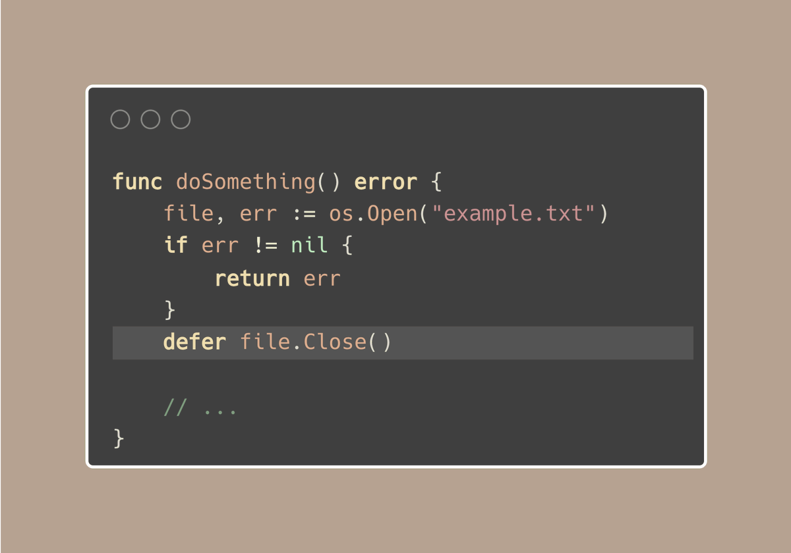
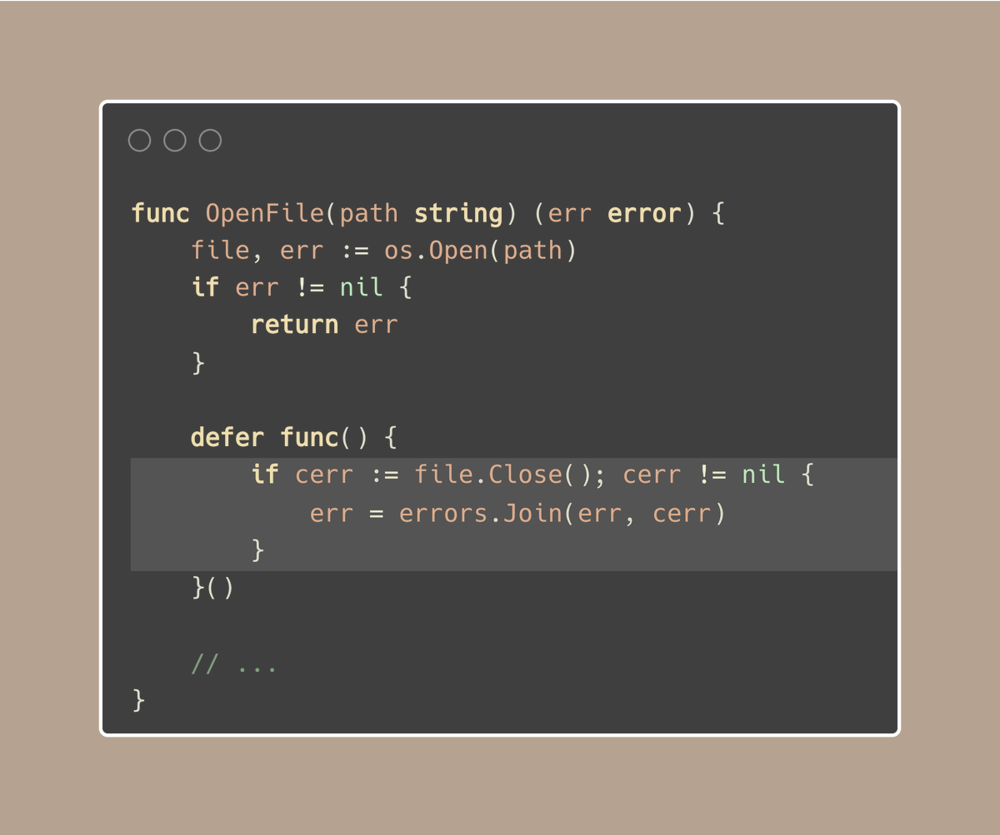
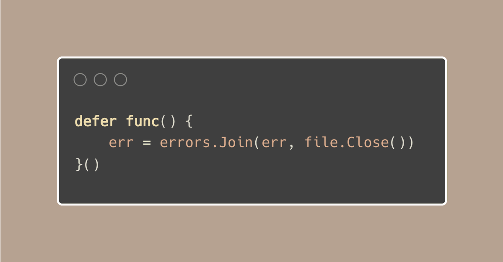
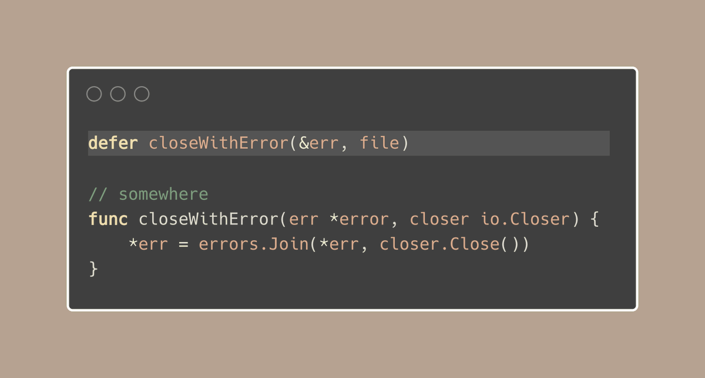

#  Tip #40 在使用defer时处理错误以防止静默失败

>  原始链接：[Golang Tip #40: Handle errors while using defer to prevent silent failures](https://twitter.com/func25/status/1764997813501608144)
>

有一个隐蔽的/易被忽视的陷阱,许多人都会落入其中:忘记检查延迟调用中的错误：

让我们以上面的代码片段为例。如果文件关闭操作失败(可能是由于写操作未刷新或文件系统出现问题),且这个错误没有被检查,我们就失去了优雅处理故障的机会。现在,仍然使用defer,我们有3种选择:
- 将其作为函数错误处理
- Panic
- 记录日志

Panic或记录日志都很直接,但如何将其作为函数错误处理呢?在这种情况下,使用命名返回值可能是一个简单的解决方案:

或者更简短的方式:

然而,由于需要创建一个匿名函数,这种方法仍然有些冗长,增加了嵌套层次。考虑到大多数延迟调用都涉及关闭资源,比如连接或I/O操作,我们可以使用一个更简洁的一行解决方案来简化,使用io.Closer:
 

但是这段代码会导致panic,因为当err可能为nil时对其解引用,对吗?

实际上并非如此,这段代码可以正常工作。

(警告,以下是大段的分析)

幸运的是,由于error是一个接口,`nil error`并不意味着它就是其他指针类型(如`*int`)的nil指针。

一个nil(接口)error的结构是{type=nil; value=nil},但它仍然...是一个值,即接口的零值。

当我们在`defer closeWithError(&err, file)`调用中使用`&err`取err的地址时,我们得到的不是一个nil指针。我们得到的是一个指向接口变量的指针,该变量的值为`{type=nil, value=nil}`。

所以在`closeWithError`函数中,当我们使用`*err`解引用错误指针来赋予新值时,我们并没有解引用一个nil指针(那会导致panic)。

相反,我们是通过指针修改了一个接口变量的值。