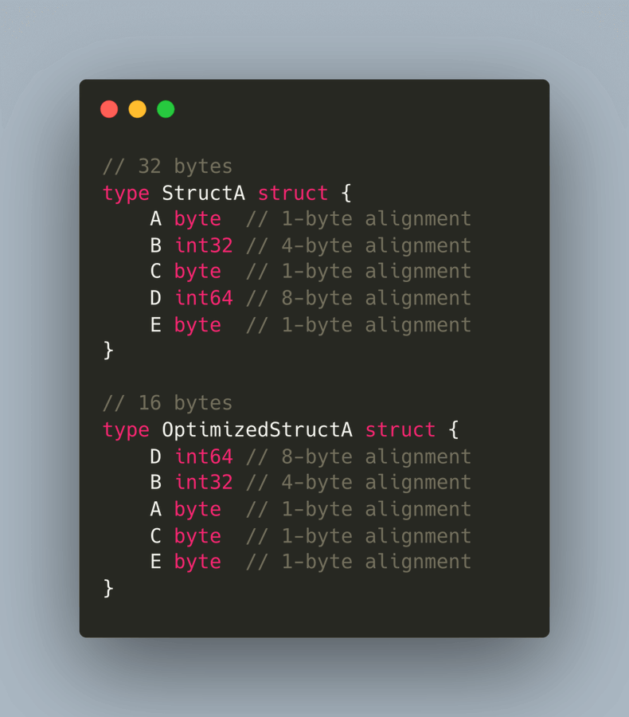
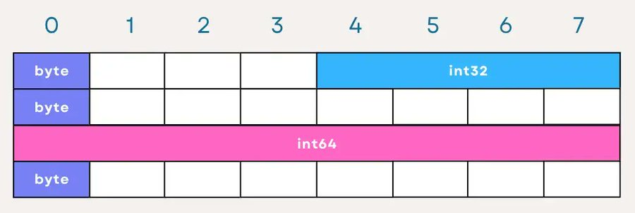
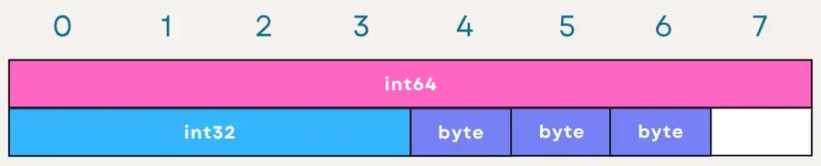

# Tip #41 将你结构体中的字段按从大到小的顺序排列

> 原始链接：[Golang Tip #41: Sort your fields in your struct from largest to smallest.](https://twitter.com/func25/status/1765371933053612110)

_（我之前发过一些关于字段填充和对齐的推文，但这次我想把它作为一条 tip 分享）_

结构体中字段的顺序确实会影响到结构体自身的大小，这意味着我们可以利用这一点来优化内存的使用，不是吗？

让我们来看一个示例（暂时忽略每个字段的注释）：

结构体 `StructA` 使用了 32 字节，而 `OptimizedStructA` 仅需要 16 字节。

为了理解为什么具有相同字段的两个结构体大小不同，让我们探讨一下字段的对齐和填充：

- **对齐**：数据类型根据其大小具有特定的对齐要求。

例如，一个 `int32` 类型可能需要在 4 字节边界上对齐，这意味着它的启始内存地址应该是 4 的倍数。

- **填充**：为了满足对齐要求，编译器可能会在结构体字段之间插入未使用的空间（填充）。

让我们看看 `StructA` 的内部表示，它的大小为 8x4 字节，让我们尝试使用上述的思路来解释：

以下是对 `StructA` 每个字段的解释：

- A（byte）：占用 1 字节，但由于下一个字段 B 需要 4 字节对齐，因此在 A 后面有 3 字节的填充以正确对齐 B。
- B（int32）：4 字节，后面不需要填充，因为下一个字段 C 是一个字节。
- C（byte）：同样占用 1 字节，但为了对齐 D（需要 8 字节对齐），在 C 后面添加了 7 字节的填充。
- D（int64）：8 字节，完全利用了它的空间。
- E（byte）：最后一个字节，在内存中直接跟在 “D” 的后面，根据上下文可能会导致在结构体的末尾添加额外的填充以将整个结构体的大小对齐到边界。

现在来看看 `OptimizedStructA`：

- D（int64）：最先被放置以利用其 8 字节对齐的要求，无需前置填充。
- B（int32）：紧随其后，在 D 后自然对齐到 4 字节边界。
- A，C，E（byte）：随后组合在一起，由于它们是单字节类型，它们之间不需要额外的填充。

通过将字段按从大到小的顺序排列，我们可以让所需的填充最小化，从而减少结构体（和内存）的总大小。

像 **betteralign** 这样的工具可以检测到效率低下的对齐方式，并可能帮助自动重新排序以提高效率：

https://github.com/dkorunic/betteralign

需要注意的是，为了效率而重新排序并**不**总是适用或必要的。

保持结构体字段按照其使用方式或重要性进行有意义的顺序排列，即使这种方式并不使用最少的内存，也可以使代码更易于阅读和使用。
