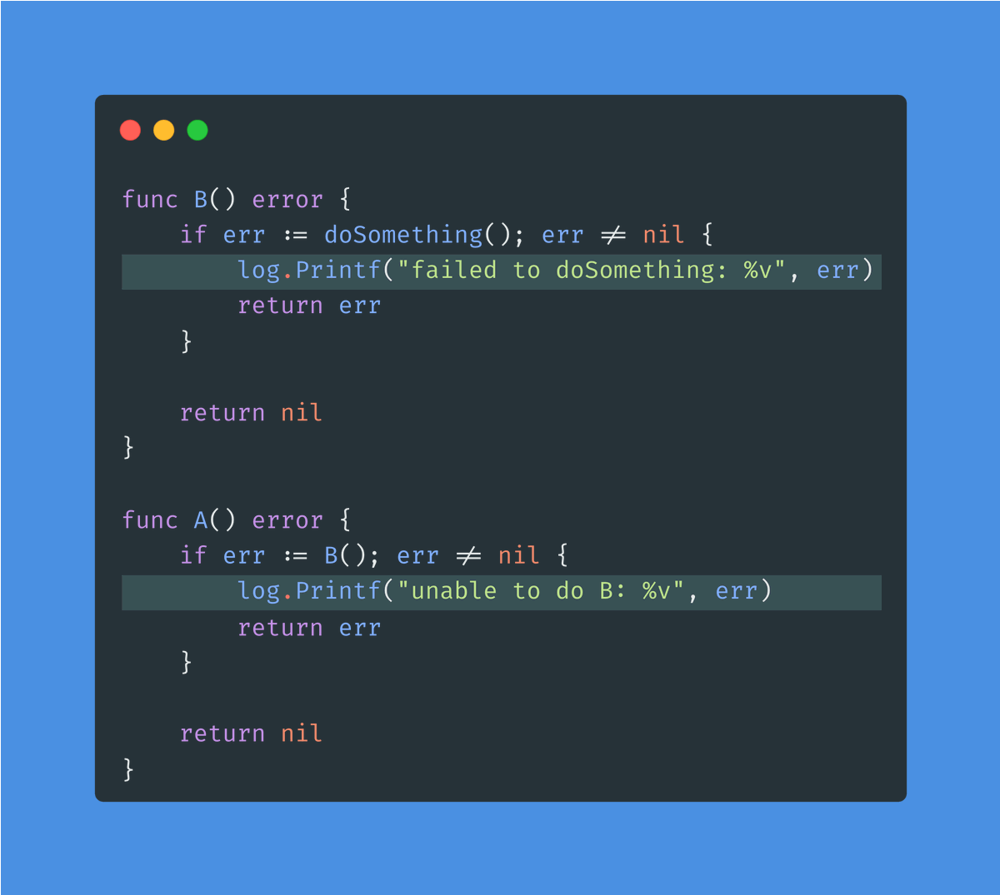
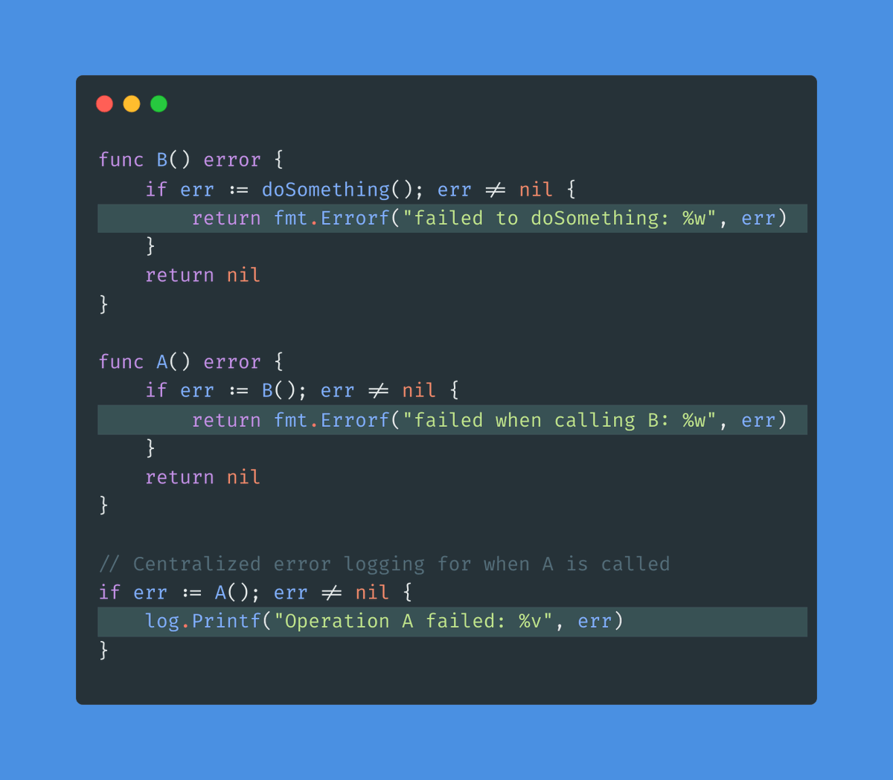

# Tip #42 单点错误处理，降低噪音

> 原始链接：[Golang Tip #42: Single Touch Error Handling, Less Noise.](https://twitter.com/func25/status/1765716456501817766)

这是我以前处理错误的方式，假设我们有一个函数 A 调用函数 B，两个函数都处理错误，如下所示：

- 当 B 产生一条错误时，将问题记录日志，并将错误传递给 A。
- A 收到此错误后，重复同样的操作：记录日志，也可能将错误传递给上层的调用链。

### 这有什么问题？

这似乎是彻底的错误处理方式，因为我们可以从一条条日志中追溯错误来源，但实际上只会制造噪音。

这些问题是：

- **重复记录日志：** 这会在日志文件中制造噪音，使得诊断问题变困难，因为相同的错误被记录了多次。

- **错误处理变复杂：** 它增加了错误处理逻辑的复杂度。

- **潜在的其他错误：** 多次错误处理意味着更多的代码，更多的代码意味着更多的潜在 bug。

一条错误，只考虑处理一次，但是如何有效的做到这点呢？

### 更好的解决方案

一个更好的处理方法是决定在本层处理错误，还是将错误返回给上层处理（但不要同时都处理）。

如果你选择返回错误不记录日志，考虑给错误添加更多上下文（参考[Tip #38](./038.md) , 原链接[https://twitter.com/func25/status/...](https://twitter.com/func25/status/1764265328165753176)）

让调用者来决定如何处理错误，是记录日志，产生恐慌，包装额外的上下文，还是采取一些纠正措施。
