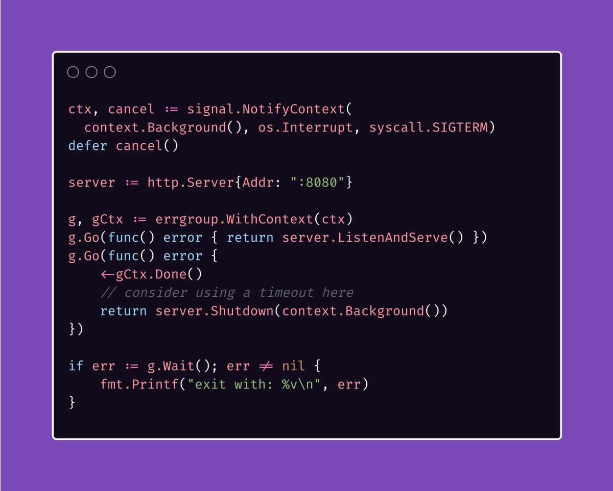

# Tip #43 优雅关闭你的应用程序

> 原始连接：[Golang Tip #43: Gracefully Shut Down Your Application ](https://twitter.com/func25/status/1766104130303705226)

当我们讨论优雅地关闭应用程序时，有几个关键保证是我们力求实现的：

- 不接收新请求：服务器停止接受新的请求。
- 完成正在进行的任务：等待当前处理的任务达到逻辑上的停止点。
- 资源清理：释放诸如数据库连接、打开文件、网络连接等资源。

虽然存在一些不同的实现方式，但为了简化起见，我尝试给出最简短的方法：

首先，我们创建一个（主）上下文，当接收到中断信号（`Ctrl+C`）或 `SIGTERM` 时将其取消。

接着我们创建两个 goroutine，均由 `errgroup` 协调（如果您还不了解它，请考虑阅读 https://blog.devtrovert.com/p/go-errgroup-you-havent-used-goroutines）：

第一个直接启动服务器，但要记住，`ListenAndServe` 始终返回非空错误。
第二个更有趣，这是我们放置优雅清理代码的地方。这个 goroutine 等待 `gCtx.Done()`关闭，该关闭状态由我们的主 `ctx` 传播而来。

如果您的服务运行在 Kubernetes 上，应考虑在接收到 SIGTERM 后不立即终止新请求。

您的应用程序不应立即终止，而应完成所有活跃请求，并继续监听 Pod 关闭开始后到达的传入连接。

Kubernetes 可能需要一段时间来更新所有 kube-proxy 和负载均衡器。

这是简化版，您可能需要考虑为服务器配置添加超时、检查错误是否关闭、为关闭过程添加超时等。
