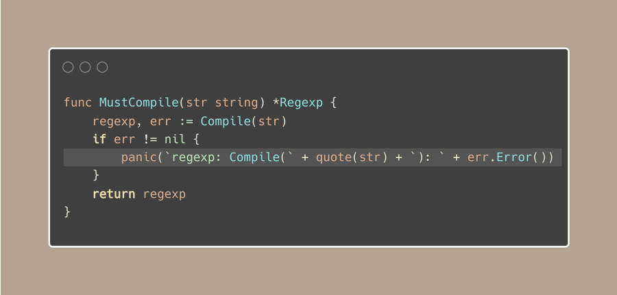

# Tip #44 有意地使用Must函数来停止程序

>  原始链接：[Golang Tip #44: Intentionally Stop with Must Functions](https://twitter.com/func25/status/1766442686624784496)
>

这是一个乍一看有点儿反直觉的技巧，就是使用“Must”函数有意地允许程序停止。

通常情况下，我们会尽可能的避免程序发生panic的情况，但是在某些情况下，这种解决方案可以避免一些冗余的逻辑。

如果你使用过Go语言，你很可能已经在标准库里见过这类函数了。

这类函数有一个特定的命名模式，它们以“Must”（或“must”）开头，这就是提醒你需要警惕一下，如果程序没有按照预期执行的话就会导致panic。

Must函数主要用于：

- 通常情况下不应失败的**初始化**任务，例如：在应用程序开始时设置包级变量、设置正则表达式、连接数据库等。

- 它们在**单测**场景下也非常有用，允许使用t.Fatal立即失败这个测试用例。

Must函数是在初始化和编写单元测试时候的工具，用于处理难以预料的情况。

它简化了在特定场景下的处理错误的方式，但是应该谨慎的使用避免panic。

（谈论一个鼓励我们的应用程序停止的小技巧可能会感觉有点奇怪 😬）