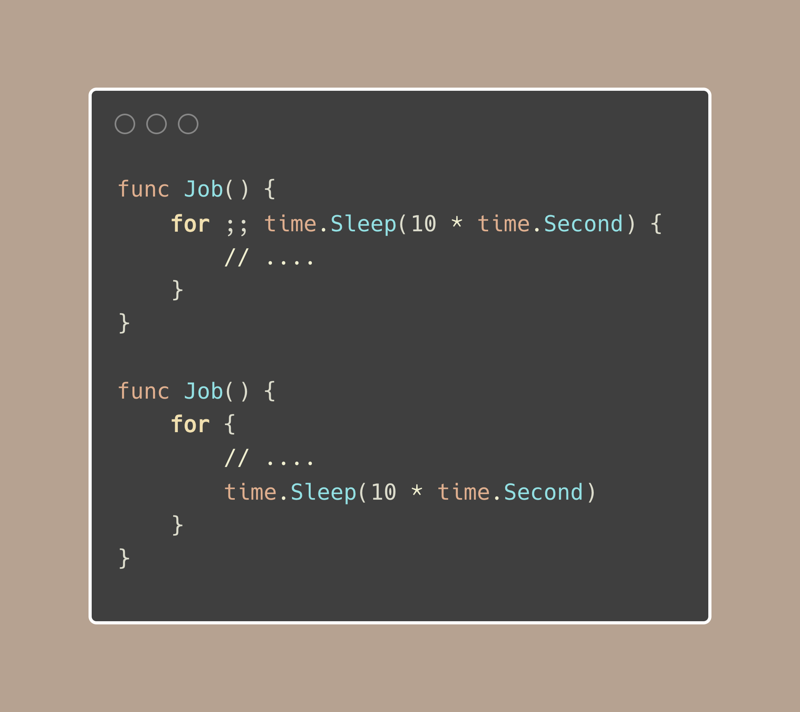
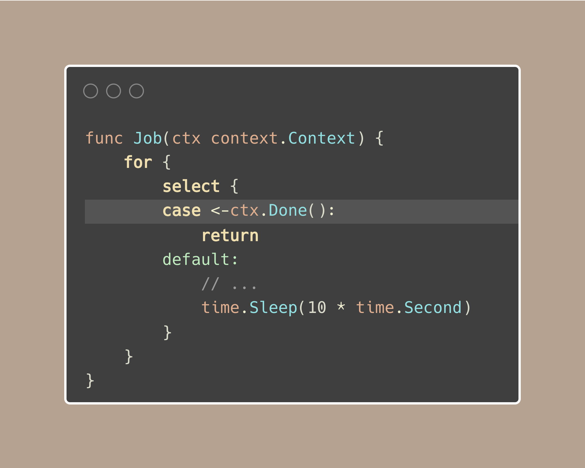
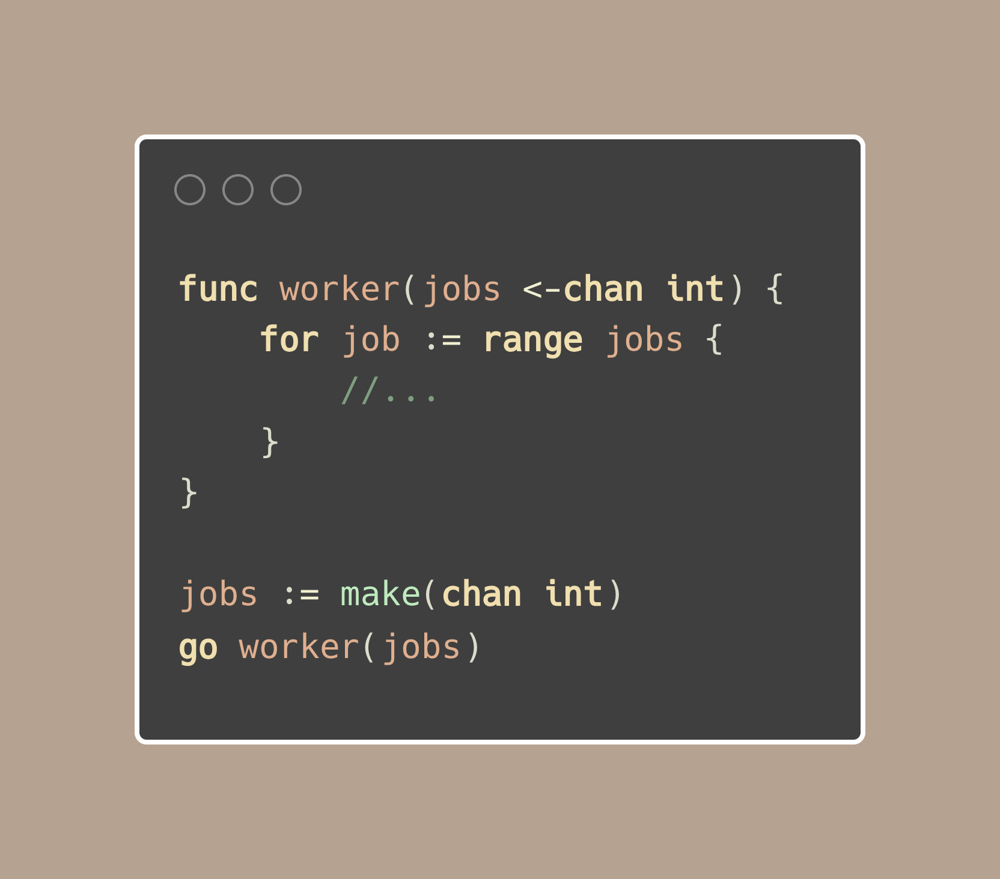

# Tip #45 始终管理您协程的生命周期

>  原始链接：[Golang Tip #45: Always Manage Your Goroutine Lifetime.](https://twitter.com/func25/status/1766815880745533712)
>

Golang 中的协程是有栈协程，这意味着相比较于其他语言中的类似结构，Golang 中的协程会占用更多的内存，每个 Golang 协程至少会占用 2KB 的内存。不要小看这 2KB 的内存占用量，因为在 Gloang 中，协程的创建是非常便捷的，很容易就快速增长到一个庞大的数量，当协程数量达到 10K 时，其内存占用将达到 20MB。

*(!: 我会将相关信息放置在本 Tip 的底部)*

我必须承认，我运行过很多使用 for 循环和 `time.Sleep` 的任务，其代码类似如下：

以这种（懒惰）方式编写代码非常方便，但这样做也有缺点。

如果你阅读了关于优雅关闭的第 43 条 Tip，你就会明白，这个函数无法优雅地结束（除非在 `time.Sleep` 期间偶然发生），对吧？

睡眠（Sleep） -> 终止信号（SIGTERM） -> 运行中（Running） -> 被中断（Interrupted）。

因此，对于那些本质上没有明确终点的任务（例如：网络连接服务、配置文件监视等），应该使用取消信号或条件来明确定义这些任务何时应该结束。

上面代码中使用了上下文 `context`，此上下文应该是由其他代码中的上下文（基础上下文）传播而来，当收到终止信号 `SIGTERM` 时，基础上下文会被取消，进而导致此处的代码在上下文处直接返回。

因此，至少我们知道上面这段代码何时停止，即使是在程序终止的时候。

以下是另一个可能导致 Golang 协程永远卡住的场景：

我们可能认为：一旦作业通道关闭，就很容易确定协程何时结束。

但是工作通道何时会关闭呢？

也许并非如此，我们可能会犯一个错误，即：没有关闭通道而是直接从函数中返回，这会导致协程无限期地挂起，进而引发内存泄漏。

因此，务必确保协程的启动和停止时机是显而易见的，并务必将上下文传递给长时间运行的任务。

---

阅读更多：

* Golang 协程是有栈协程：[https://twitter.com/func25/status/1762632488219004931](https://twitter.com/func25/status/1762632488219004931)；
* 第 43 条 Tip：[https://twitter.com/func25/status/1766104130303705226](https://twitter.com/func25/status/1766104130303705226)。

