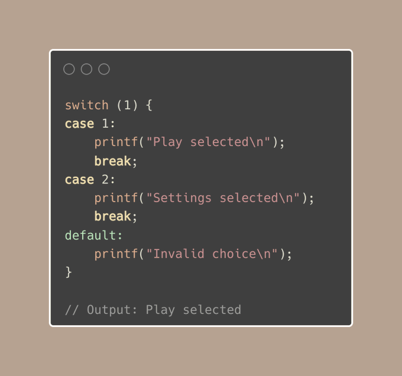
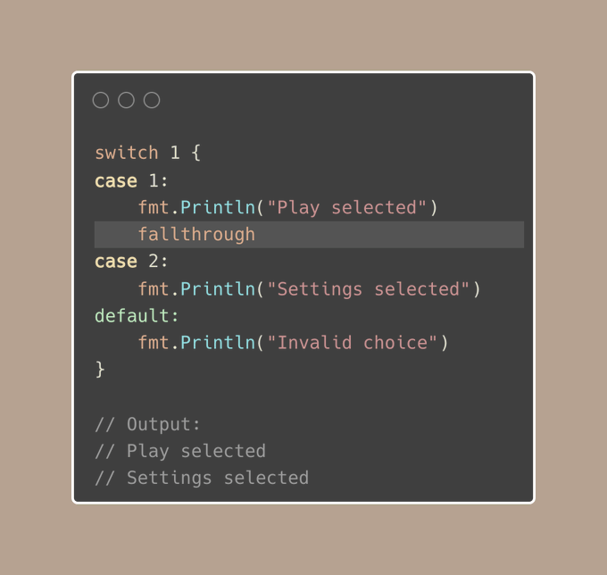
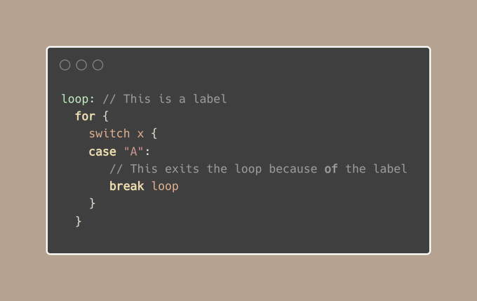

# Tip #46 避免在 switch 语句的 case 中使用 break，除非与标签一起使用
>  原始链接：[Golang Tip #46: Avoid using break in switch cases, except when paired with labels.](https://twitter.com/func25/status/1767165749116948584)
>

在 C、C#、Javascript 等语言中，常常在 switch 语句的每个 case 末尾使用 break 来避免代码错误地继续执行下一个 case：

但是 Go 的处理方式有所不同，Go 的 switch 语句中的每个 case 自带一个隐式的 break。

这就意味着 Go 会在执行完匹配到的 case 后自动停止，无需显式添加 break 语句：

在 case 匹配后自动退出 switch 是 Go 语言的有意为之。

大多数情况下，这正是我们所希望的：一旦找到匹配项就停止执行，而继续执行到下一个case的情形很少见。Go语言的设计哲学是专注于最常见的需求，而非极端特例。

> “*如果我需要继续执行到下一个 case 怎么办？*”

对于这种不常见的需求，Go 提供了**fallthrough**关键字，允许执行流程从当前 case 继续执行到下一个 case。

如果我们在循环内使用 switch 并且想要完全跳出循环，该怎么操作呢？

switch内部的break并不会影响外部的循环，如果我们希望基于switch中的条件退出循环，我们需要使用标签：

使用标签，可以精确指定从哪里跳出，以达到从循环中退出的效果。

---

[探索Go中switch语句的6种使用方式]( https://twitter.com/func25/status/1745774945920245800 )
[技巧 #31：使用循环标签实现更清晰的break和continue操作](https://twitter.com/func25/status/1761694371240702098)