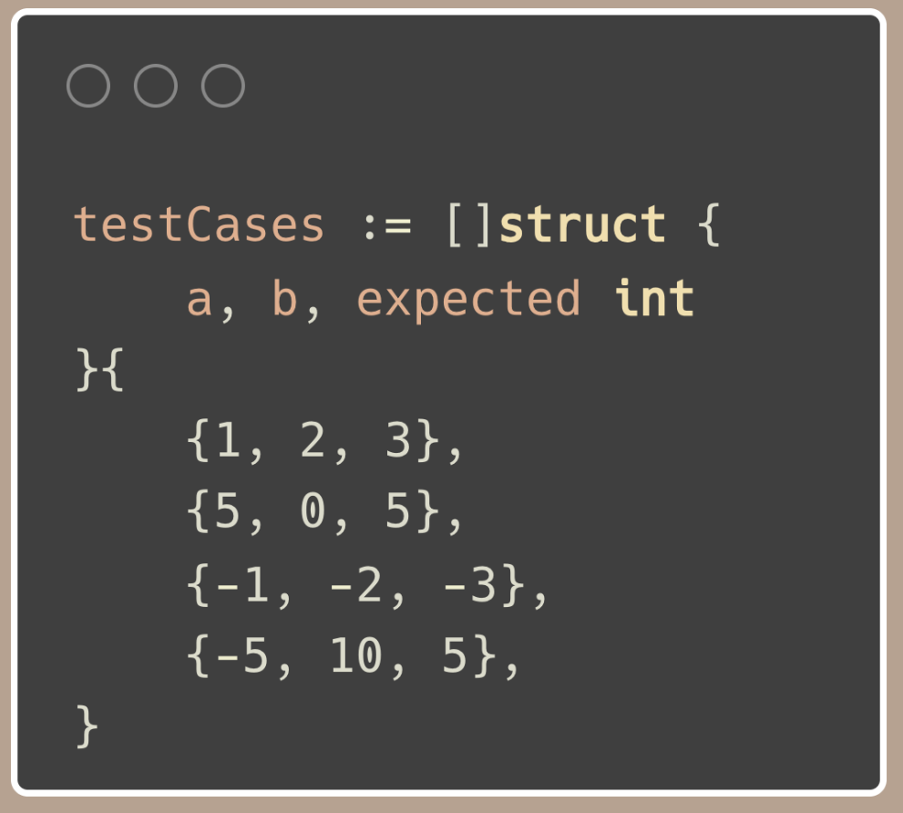
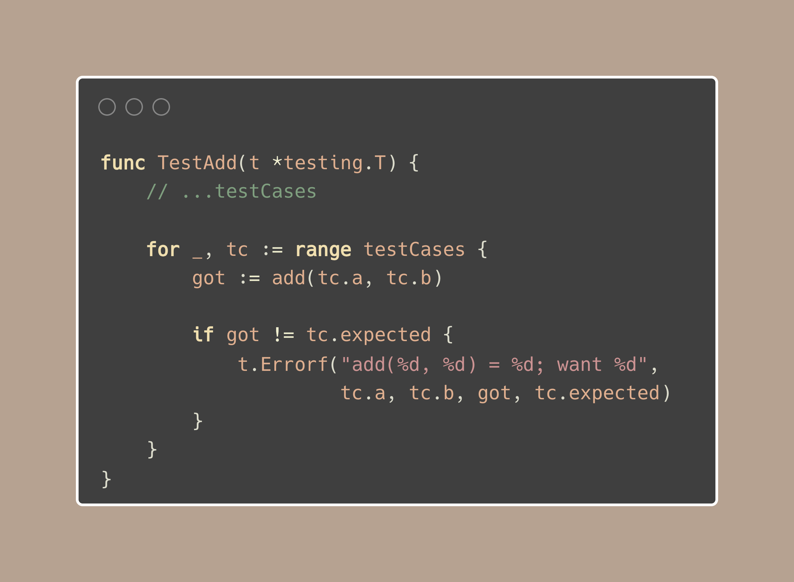
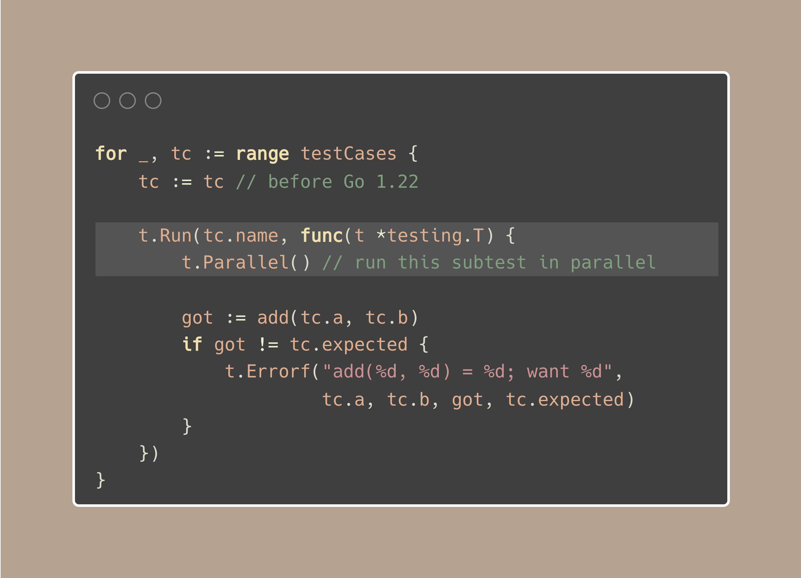

# Tip #47 表驱动测试，测试集和并行运行测试

> 原始链接：[Golang Tip #47: Table-driven tests, subtests, and parallel tests.](https://twitter.com/func25/status/1767541900960276913)

如果我们的这个提示被忽略了，那可就不妙了，因为测试是确保我们在部署后, 能否够睡个安稳觉不可或缺的环节。

## 1.表驱动测试

表驱动测试是一种通过表格的方式描述单元测试的方法，详细列出输入和预期结果。

让我们看一个简单的例子：我们有一个名为 `add()` 的函数，用于计算两个操作数的和。

以下是我们的测试用例：



设置好这些之后，我们只需运行一个测试函数， 就可以将所有的测试用例跑一遍：



就像上面那样，我们可以添加任意数量的测试用例，如果有任何失败，它们将很清晰地打印在控制台（或任何终端输出）上。

例如，将 `add()` 函数误认为是将 `a`, `b` 两个数相乘后，以下会生成一些失败的测试结果：

```
--- FAIL: TestAdd (0.00s)
   add(1, 2) = 2; want 3
   add(5, 0) = 0; want 5
   add(-1, -2) = 2; want -3
   add(-5, 10) = -50; want 5
```

“但如果有一个测试失败，我不想运行其余的测试，因为会很慢。”

我们可以使用 `t.Fatalf` 而不是 `t.Errorf`，它相当于 `t.Logf` + `t.FailNow`。

现在，我们还有一件事情忘记做了：给测试用例定义名称。

当测试失败时，命名变得非常重要。它能帮助我们快速定位哪个测试未通过，而无需仔细查看输入和预期结果。

### 2.测试集和并行运行测试

测试集让你以逻辑方式组织测试，并将它们作为较大测试函数的一部分运行。

首先，让我们给每个测试用例一个名称：


然后，我们通过稍微修改，就能生成一个测试集，并进行并行运行，注意这两处更新：


现在控制台上打印的结果非常清晰， 它们以层次结构显示了哪个测试和哪个子测试失败：

```

--- FAIL: TestAdd (0.00s)
    --- FAIL: TestAdd/two_positives (0.00s)
        add(1, 2) = 2; want 3
```

这种设置使你的测试输出清晰易懂，帮助你更快地识别和修复问题。
