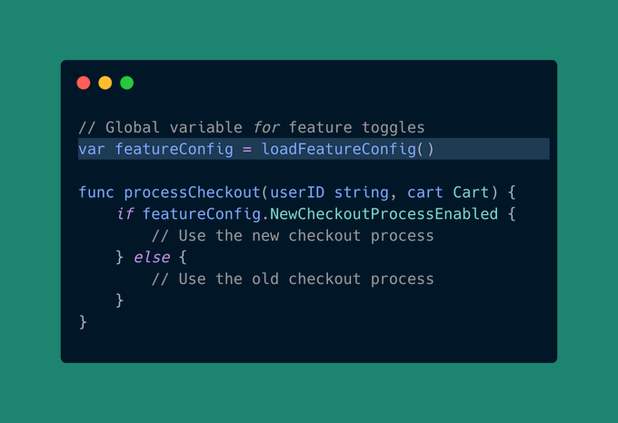
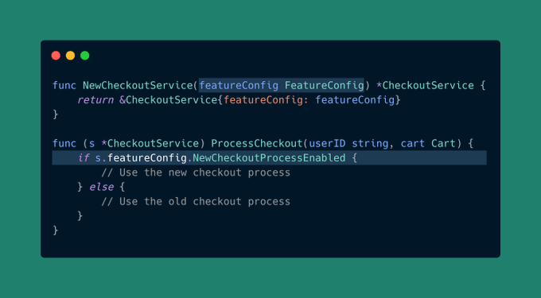
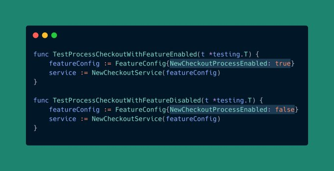

# Tip #48 避免使用全局变量，尤其是可变变量

> 原始链接：[Golang Tip #48: Avoid Global Variables, Especially Mutable Ones.](https://twitter.com/func25/status/1767903551303586048)

**全局变量**是我们放在函数或方法之外的变量，可供我们代码的任何部分使用和更改。

现在，我并不是说所有全局变量都是坏消息，但它们带来的麻烦往往大于其价值。

原因如下（使用上面的代码示例）：

- **难以跟踪变化**：当代码的任何部分都可以改变 `featureConfig.NewCheckoutProcessEnabled` 时，识别它被改变的位置会很困难。
- **测试变得棘手**：假设您正在测试新旧结帐流程。如果两个测试都涉及相同的全局 `featureConfig`，则您无法**独立**测试它们，因为其中一个测试会干扰另一个测试。
- **并发问题**：当多个请求同时尝试读取或更改 `featureConfig` 时，可能会导致不一致（竞态条件）。

> “那么，解决方案是什么？”

**答案是依赖注入。**

这是一种从外部满足对象需求的方法，而不是让它自己创建或从全局变量获取：

是的，这种方法确实使事情变得有点复杂，但它也使得维护代码、测试代码和查找错误变得容易得多。

通过依赖注入，测试启用和禁用功能这两种场景变得非常简单：

但是如果您的全局变量不会改变，不需要测试并且必须这样工作，那么在这些情况下坚持使用全局变量可能会更好。

此外，如果您使用在运行时发生变化的全局变量，请确保使用同步技术（如互斥锁）来保证顺序。

简而言之，从全局状态转移到依赖注入可以让您的代码保持灵活性，并且不会过度依赖或紧密 “耦合”。
