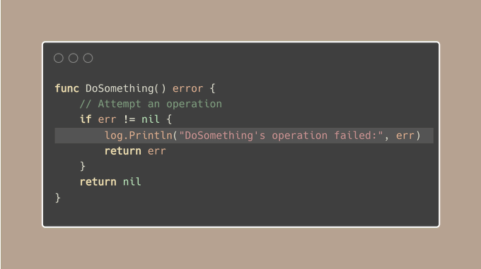
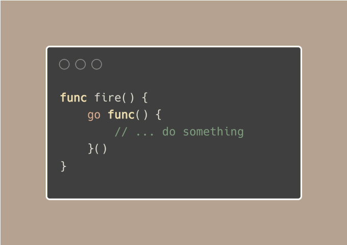

# Tip #49：赋予调用者决策权

> 原始链接：[Golang Tip #49: Give the Caller the Right to Make Decisions.](https://twitter.com/func25/status/1768270595521929430)

想法是这样的：当你编写函数或包时，你必须决定：

- 如何管理错误，是打印日志还是触发 panic？
- 创建 goroutine 是否合适？
- 将上下文超时设置为 10 秒是个好主意吗？

关键原则是允许代码的使用者（调用者）拥有做出这些选择的控制权和**职责**，而不是在你的代码中为他们做出决定。

让我们看一些例子。

## 1. 处理错误

这是一个记录错误并将其返回给调用者的示例：

与其在你的函数里触发 panic 或打印错误，不如**只**将错误发送给调用者。

这种方法可以让调用者找到最佳的处置方案，可以是记录错误，再试一次，或者在情况确实无法恢复时触发 panic。

> “为什么不在我们的函数和调用者的函数里同时记录错误，以便更容易地追溯？”

这个想法与 [Tip #42：单次错误处理，减少噪音](./042.md) 相关。

大体来说，我们让调用者根据自己的情况来确定错误的严重程度。

## 2. Goroutines

我见过一些用来运行后台任务的函数，像下图这样：

当函数需要执行并发操作时，我们倾向于启动一个 goroutine。

但是，通常让调用者决定何时以及如何处理并发会更好，`go fire ()`

上面的例子也缺乏控制，我们可能希望给予调用者权限来控制 goroutine 的生命周期。

## 3. 其他操作

这个原则不仅限于启动 goroutine 和错误处理，我之所以关注它们是因为它们与我们的语言密切相关。

它包括更多代码设计决策，它们都与允许调用者决定相关：

- 操作在超时前应等待多长时间
- 使用什么级别的日志记录
- 是否使用数据库事务
- 以及更多...

然而，就像软件开发中的许多技巧一样，一切都是权衡。你不会想用太多选项让调用者心智负担过重。

通过将关键决策交给调用者，您的代码将变得更具适应性、可重用性，并能够**适用不同的上下文**。
