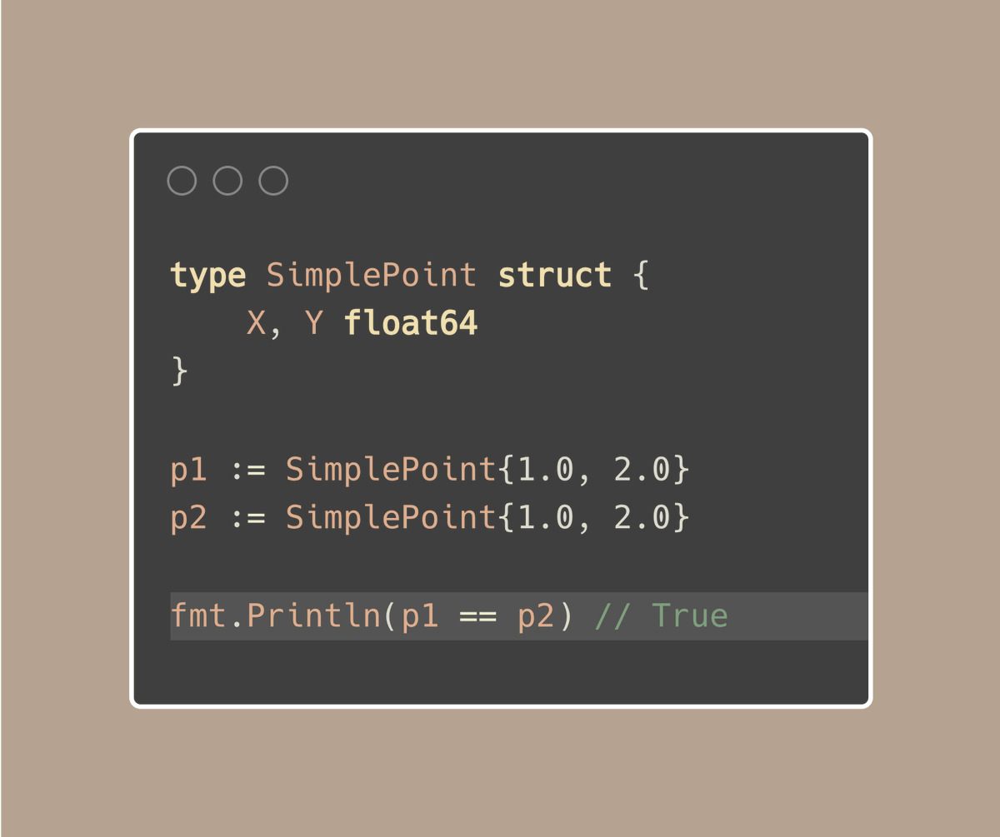
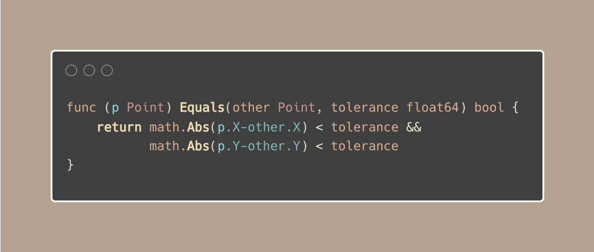
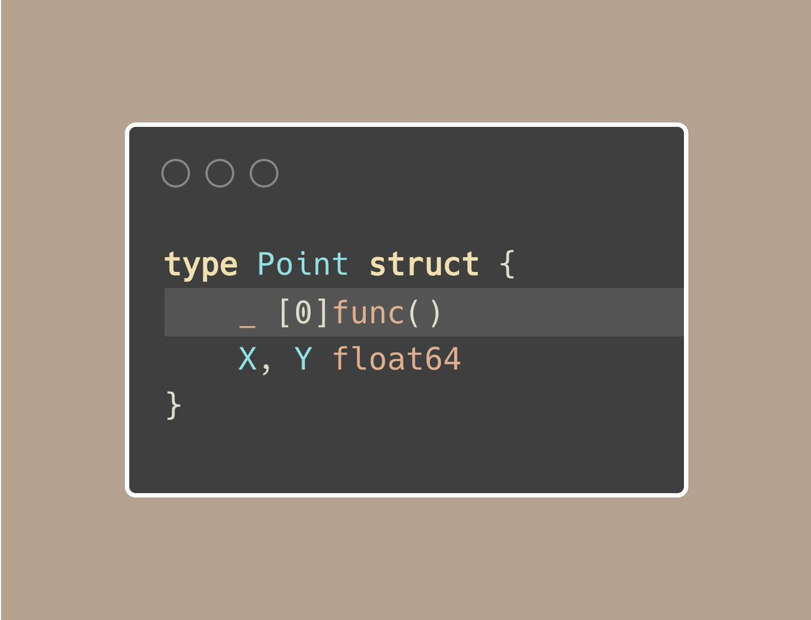
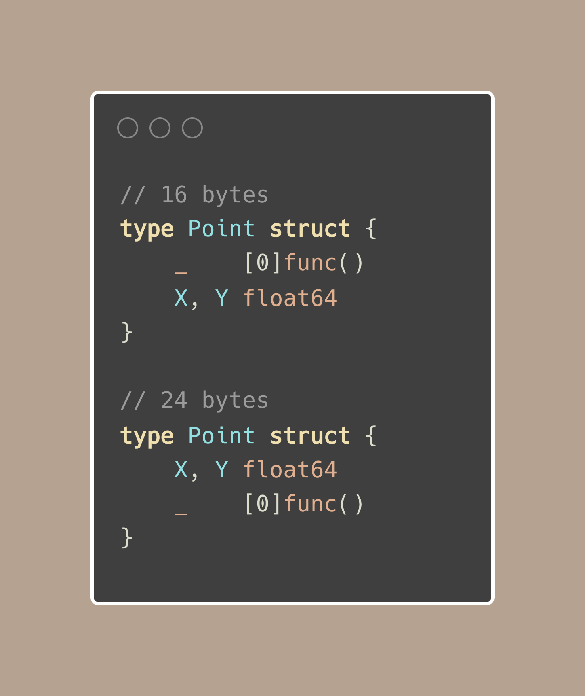

#  Tip #50 使结构体不可比较

>  原始链接：[Golang Tip #50: Make Structs Non-comparable](https://twitter.com/func25/status/1768621711929311620)
>

在Go语言中,如果一个结构体中的每个字段都是可比较的,那么该结构体本身也是可比较的。这意味着你可以直接使用`==`和`!=`运算符来比较两个结构体:

但是,直接比较包含浮点数的结构体可能会有问题。理想情况下,浮点数值应该使用近似值进行比较。我们可能更希望团队成员使用自定义的`.Equals`方法进行比较:

但让我们面对现实,使用`p1 == p2`是直接、快速的,对于不了解浮点数比较细微差别的任何人来说都是很诱人的。为了确保每个开发人员都使用您的比较方法,这里有一个零成本的策略:

`[0]func()` 有3个特性:
- 非导出的: 对于你的结构体的使用者来说是隐藏的。
- 零宽度(或无成本): 因为长度为0,所以这个数组在内存中不占用任何空间。
- 不可比较: func()是一个函数类型,而函数在Go中是不可比较的。

试图直接使用`==`或`!=`比较这种结构体的两个实例将触发编译时错误:
"invalid operation: a == b (struct containing [0]func() cannot be compared)"

**但是,请记住不要将[0]func()放在最后。**

虽然它不占用空间,但它的位置仍然可能影响我们结构体的大小:

关于字段对齐(和填充)的进一步理解,可以参考以下两个资源:
- tips#41:按从大到小的顺序排列结构体中的字段。(https://colobu.com/gotips/041.html)
- Go仓库中的Issue #9401: https://github.com/golang/go/issues/9401