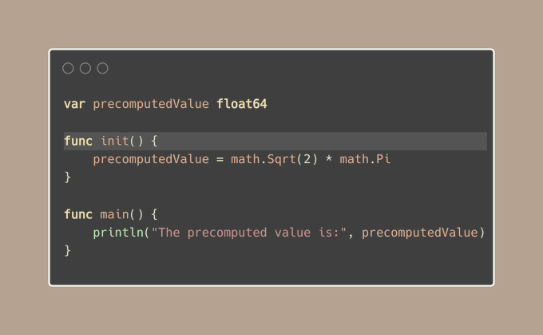
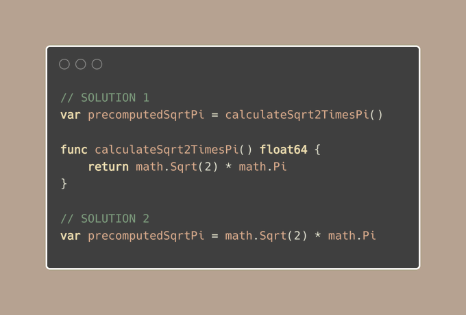

# Tip #51 避免使用init()

> 原始链接：[ Golang Tip #51: Avoid using init()](https://twitter.com/func25/status/1769002177643860116)

`init()` 是一个特殊的函数，它在主函数**之前**和全局变量初始化**之后**运行：

它通常用于准备一些全局变量，但最好保持全局变量的数量尽量少。

[Golang Tip #48 避免使用全局变量，尤其是可变变量](./048.md)

我们的示例无法将 `precomputedValue` 设置为常量值，因为它依赖于在运行时计算的值 `math.Sqrt(2)`。

但是，有一种更好的方法：

> “现在，为什么我们应该避免使用 `init()`？”

1. 副作用

`init()` 可以更改全局状态或引起其他意外效果。

这意味着仅仅添加一个包到您的程序中就可能改变您的程序的行为方式，使您更难理解正在发生的事情。

2. 测试挑战

您的测试可能因与您实际测试的内容无关的原因而失败或通过，只是因为其中一个导入的 `init()` 函数执行了一些意外操作。

3. 团队合作

无论您是在一段时间后重新访问自己的代码，还是深入研究其他人的代码，记住或找到 `init()` 函数在您的程序行为中扮演一个角色可能会很棘手。

4. 全局变量

`init()` 经常设置全局变量。

但是，对全局变量要谨慎，因为它们可以从代码的任何地方访问并进行更改，这通常是您想要避免的。

只要可以，让您的包的使用者处理设置（只要对他们不会不方便）。

这样，一切都更加开放，且更容易从外部进行管理。

5. 如果您想使用它，随意

现在，我们并不是要强烈反对使用 `init` 函数。

如果您仍然想使用 `init()`，因为：

- 您不希望用户每次都要调用 `yourpackage.Init()`。
- 为您的包注册一些钩子以使其工作（而不是更改其他内容）。
- 您的包依赖于环境变量进行操作（这是许多标准库的常见情况）。
- 您的全局变量需要根据不同的构建标签进行变化。
- ...

因此，这里有一些指导原则：

- 避免外部调用（包括 I/O）。
- 避免启动 goroutines。
- 不要依赖其他包的 `init()` 顺序。
- 保持其他包的全局变量不变。
- 考虑将您的 `init` 函数放在调整它的全局变量附近。
- 在全局变量上方添加注释，指明涉及哪个文件的 `init`。

最重要的是，要保持确定性，您的 `init()` 函数无论运行多少次都产生相同的结果。
