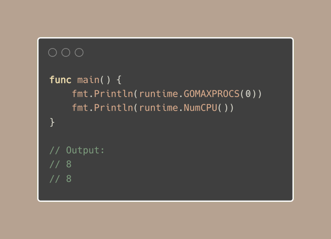
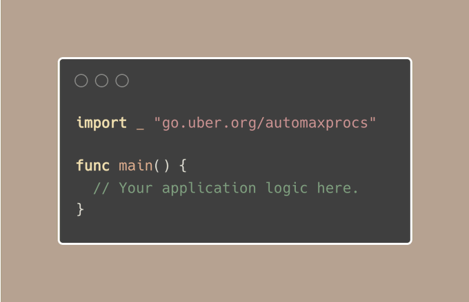

# Tip #52 针对容器化环境（Kubernetes、Docker 等）调整 `GOMAXPROCS`

> 原始链接：[ Golang Tip #52: Adjusting GOMAXPROCS for Containerized Env (Kubernetes, Docker, etc.)](https://twitter.com/func25/status/1769315593122177195)

**什么是 `GOMAXPROCS`？**

默认情况下，Go 可以并发执行高达 10,000 个线程，但实际上并行运行的线程数量取决于一个关键设置：`GOMAXPROCS`。

`GOMAXPROCS` 决定了可以同时运行用户级 Go 代码的系统线程数量上限（注意是真正的并行执行，而不仅仅是并发）。

它的默认值与操作系统的逻辑 CPU 核数是一致的（可通过 `runtime.NumCPU()` 函数获取）：

例如在我的 8 核 MacOS 上，默认情况下 Go 可同时处理多达 8 个线程。

**容器化环境（Docker 和 Kubernetes）运行 Go 程序**

在诸如 K8s 这样的容器化环境下，我们可以为每个容器设置 CPU 限制，实际上是在告诉容器：“你最多能使用这么多 CPU 资源”

例如，限制参数为 250m 意味着可以使用 1/4 个 CPU，而 1 则表示可以使用 1 个 CPU。

然而 Go 默认没法自行识别容器配置的 CPU 资源限制。它依旧会根据宿主机上的 CPU 核心总数进行运算，而非容器分配到的数量。

（宿主机或节点上可以运行多个 pod）

结果就是，Go 程序可能会尝试使用超过其被分配份额的 CPU 。

> “难道不是使用更多 CPU 资源更佳吗？”

这背后有几个原因：

1. 上下文切换：当线程数量超过 CPU 核心数量时，操作系统会频繁在多个线程间切换。

2. 调度效率低：Go 的调度器可能会创建出比实际 CPU 限制下可执行的更多的 goroutine，从而导致 CPU 时间的争夺。

3. CPU 密集型任务的使用效率欠佳：Go 程序通常是 CPU 密集型的，这意味着当每个线程可以分配到一个独立的 CPU 上执行，而无需等待时，它们的表现最佳。

如果我们设置的 `GOMAXPROCS` 超过了分配给容器的 CPU 核心数，就会迫使 Go 运行时规划超过实际可用核心数的线程，导致 CPU 密集型任务的执行效率降低。

**解决方案是什么？**

对于那些想要“省心”的开发者，[uber-go/automaxprocs](https://github.com/uber-go/automaxprocs) 可能是个不错的选择。这个库可以自动调整 `GOMAXPROCS` 以适配容器的 CPU 限制。

（如果你想了解 uber-go/automaxprocs 背后的原理，请告知我）

另外，如果你对 deployment 或 pod 规范有所了解，你可以直接在环境变量中设置 GOMAXPROCS，以匹配 CPU 限制。

但我更倾向于从 DevOps 的角度讨论这个问题，建议尽量避免设置 CPU 限制，而应始终指定 CPU 请求（详情稍后说明），这一点不只是针对 Go 服务。

如果你的容器没有明确的 CPU 限制，这是一个值得深思的问题。

---

- [求你了，请停止在 Kubernetes 上使用 CPU 限制（更新版本)](https://www.reddit.com/r/kubernetes/comments/wgztqh/for_the_love_of_god_stop_using_cpu_limits_on/)
- [Kubernetes CPU 限制和 Go](https://ardanlabs.com/blog/2024/02/kubernetes-cpu-limits-go.html)
