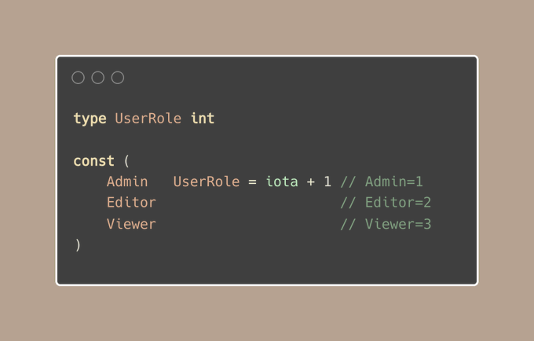
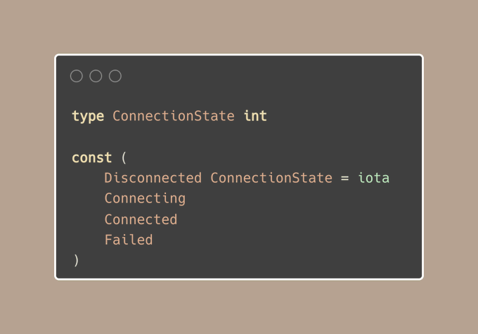

# Tip #53：枚举从 1 开始用于分类，从 0 用于默认情况

> 原始链接：[Golang Tip #53: Enums start from 1 for categorization and 0 for default cases](https://twitter.com/func25/status/1769707703939817561)
>
> Go 语言并不原生支持枚举类型，但许多开发者都熟知一种普遍的替代方案。

让我们通过一个例子来详细解释这个技巧：

若一个 `UserRole` 变量被声明而未初始化，其默认值为 `0`，这可能无意中将其设置为管理员角色。

这与我们的设想背道而驰。

以下是一条实用准则：

- 从 1 开始枚举是一种策略，确保了零值（Go 中数值类型变量的默认值）不会错误地代表一个有意义的状态。
- 当每个新创建的实例都自然而然地对应一个有意义的初始状态时，从 `0` 开始枚举是可取的。

一个更好的方案可能是这样的：

或者你可以考虑另一个解决方案，即在发生错误的情况下，其中在发生错误的情况下，一个名为 `Unknown`（未知）的角色作为默认值。

> "我倾向于将默认值设为 Viewer（观察者）是一个更好的选择。"

然而，情况并非总是如此。由于多种原因，我们需要考虑以下场景：

- 一个 Editor（编辑者）由于默认值设置不当，可能被错误地赋予了 Viewer（观察者）的角色，这可能引起潜在的逻辑错误。
- Viewer（观察者）角色可能会让某人拥有超出 Editor（编辑者）角色所需的查看权限。对于只需要处理特定内容的编辑者来说，这可能并不适合，因为他们不需要像 Viewer 那样可以查看所有内容。

因此，我们使用 0 来检测代码中的异常，并防止可能出现的任何风险。

考虑以下例子以进一步说明：

- 应用模式（开发、测试、生产）
- 状态（成功、错误、待处理）
- 行为（登录、登出、购买）

在这些情况下，每个状态都具有同等的重要性，意味着没有一个默认或优先状态。

但当存在一个明确的默认状态时，创建一个值为零的枚举是完全合适的：

决定枚举值从 0 还是 1 开始，取决于我们的具体业务需求和安全性考虑。
