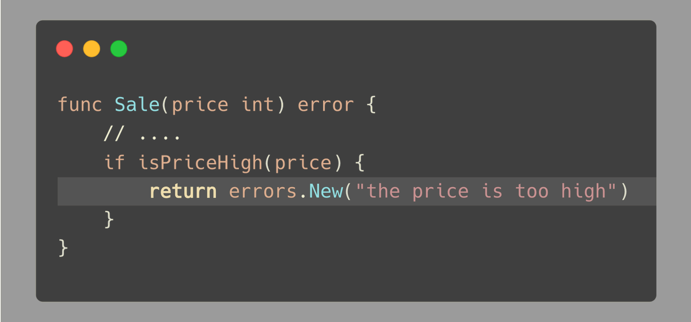
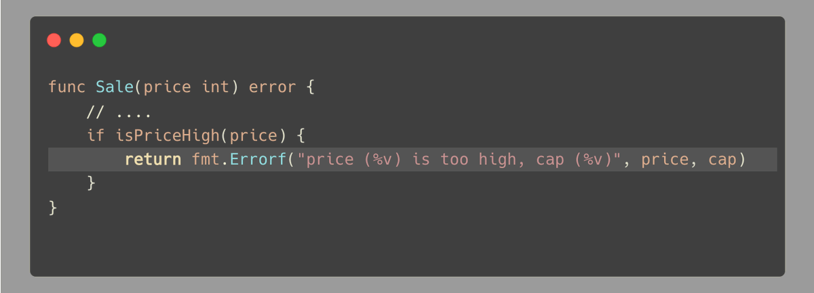

# Tip #54 仅在必要时为客户端定义error(var Err = errors.New)

>  原始链接：[Golang Tips #54: Only define errors (var Err = errors.New) when it's necessary for your client](https://twitter.com/func25/status/1770437020617433240)
>

一个在很多代码库中都有的常见误区是，为**每个**逻辑错误定义一个error，每个error都有一个高度描述性的名称和说明。

这种做法并不是总是必要的：

这通常出现在处理我们的业务逻辑的时候，开发人员想要**控制**每一个error，但是这是多余的。

这里列举一些弊端（以上述例子为例）：

- 这对于维护者是一个负担，他们必须记住或者查询每一个error的细节。
- 除了你自己之外没人知道这是冗余的，甚至不久的将来你自己也会忘记。
- 你的客户端可能不需要知道这些错误，因为前端早已限定了输入价格从高到低的区间了。

只有当客户端绕过前端直接使用API时才会遇到这个error（这是一个我们不认可的行为）。

这个原则不仅仅适用于客户端-服务端通信中，还适用于内部代码。

例如，如果你无法向消息队列中投递一个消息时，别立即就创建一个ErrPublishMessage。
很可能没有人会捕获这个error。

**那么，这些场景下推荐的做法是什么呢？**

当你的代码不需要客户端（不管是你的代码的一部分还是你写的库的外部用户）**根据error类型的不同而采取不同的行为**时，采取最简单的错误处理方法是最佳的：

或者使用fmt.Errorf，它能让你利用动态数据格式化出一个错误类型。

这在需要包含上下文相关的信息时候特别有用。

当你的应用逻辑确实需要根据error类型的不同而要采取不同的行为时，例如：

- 根据error类型决定是否重试一个操作。
- 记录特定的error到日志中去。
- 通知用户他们的资金即将耗尽，或者显示一个充值弹窗。
- ...

那么对于这些场景定义error变量才是完美的。