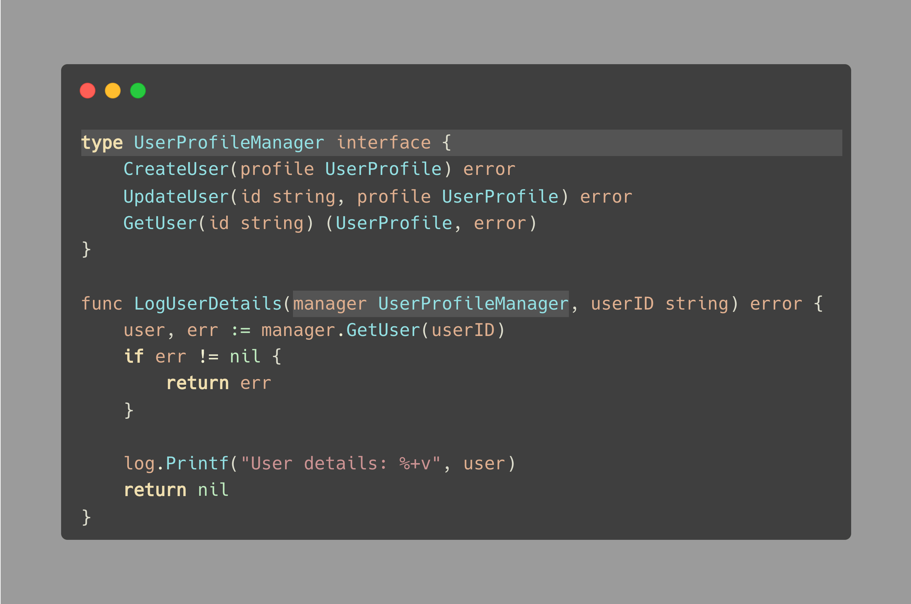
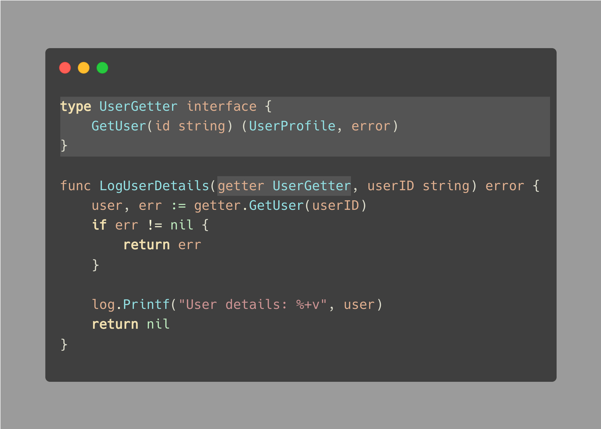

#  Tip #56 简化接口并只要求你真正需要的东西

>  原始链接：[Golang Tip #56: Simplify interfaces and only ask for what you really need](https://twitter.com/func25/status/1771187871032176691)

在Go中定义接口时，请遵循以下技巧：

<a id="1">1. </a>只有在实际需要时才定义接口。  
<a id="2">2. </a>接受接口并返回具体类型。  
<a id="3">3. </a>将接口放在它们被使用的地方（消费者），而不是它们被创建的地方（生产者）。([Tip #18](./018.md))

技巧[3](#3) 实际上是基于技巧[1](#1)的。

但是还有一个额外的技巧，让我们遵循"[2. 接受接口并返回具体类型。](#2)"

你能在下面的例子中发现一个问题吗？

上述示例仅用于展示提示的目的，可能不符合最佳实践、命名规范等。

问题是，LogUserDetails(…) 函数**仅仅**需要 GetUser 方法，而不需要 CreateUser 或 UpdateUser 方法。

这种设置并不理想，因为它将函数与一个广泛的接口绑定在一起，这使得测试变得更加困难，降低了灵活性，并且可读性较差。

接口有助于实现抽象，但是**接口越庞大，它就变得越不抽象**。

> “为什么这对测试来说是不利的？”

当我们进行测试时，我们不应该搞清楚输入接口的哪些方法被使用了，对吧？

而且，设置一个我们不需要的庞大的 Mock 对象也很麻烦。

那么，怎么做更好呢？

你可能已经猜到了，我们的函数应该请求一个只有**它需要的东西**的接口：

任何符合 UserManager 的具体类型也同样应该符合 UserGetter。

这个简单的改变使得代码更易于测试，也更清晰。