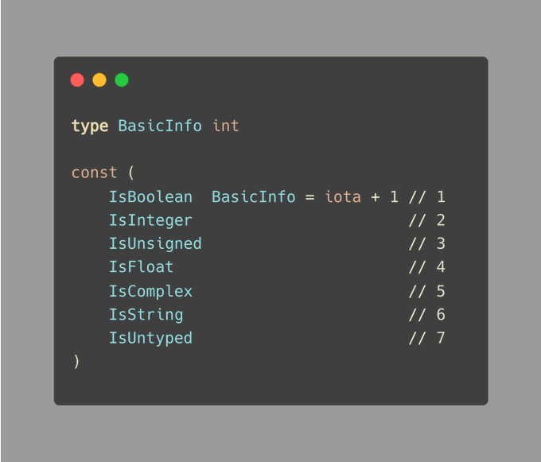
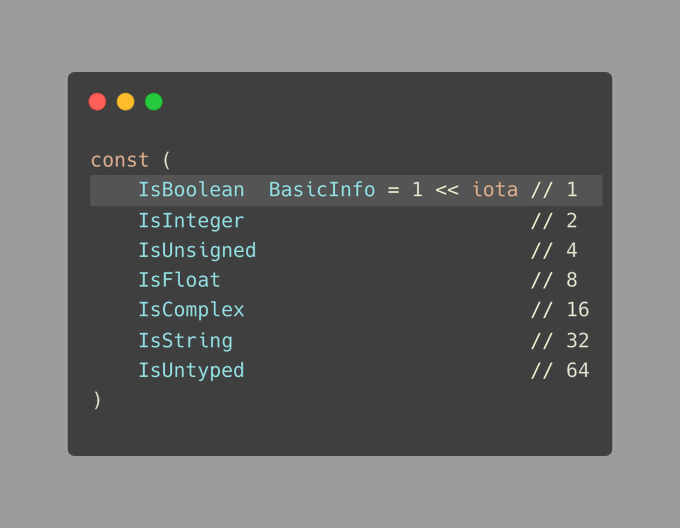
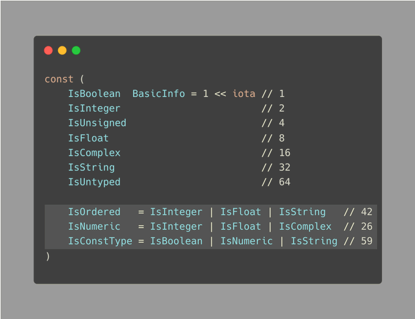

#  Tip #57：Go中的标记枚举
>  原始链接：[Golang Tip #57: Flag Enums in Go](https://twitter.com/func25/status/1771503197875749306)
> 

在 Go 语言中，枚举的定义并不像某些其他语言那样直接明了。

反而，Go提供了一个巧妙的方式，通过使用一个包含iota关键词的常量群组来创造出具有枚举行为的结构。

我们已经做了基础的介绍；现在让我们来探讨枚举所面临的问题：

为了从 1 开始我们的枚举项，我们使用了 `iota + 1 `的方式。。

当我们需要为特殊情况保留零值，或者零值在我们的上下文中没有实际意义时，这种方法会非常有用，正如我们在技巧[#53](./053.md)中所讨论的。

> 在上述例子中，如果一个类型同时可以是整数和无符号数该怎么办？

当然，我们可以定义一个新的类型，比如UnsignedInteger，但随着我们增加更多的组合类型，这种方法的可扩展性并不理想。

**标记枚举（Flag Enums）**

在实际开发中，我们可能更倾向于使用位掩码或标志枚举。

这是一种使用枚举的新方法，它允许我们将多个状态或属性合并到单个变量中：

通过使用标志枚举，我们可以同时标记某个变量具有 IsInteger 和 IsUnsigned 属性，而无需为此创建新的类型。

我们利用位或运算符`|`表明unsignedInteger同时拥有这两种属性：

为了增强代码的可读性，你可能会选择以下方式定义新的枚举：

这段代码实际上是从 Go 语言的源代码中直接摘录的。