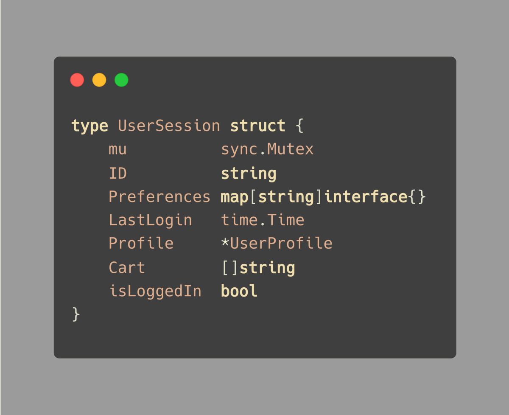
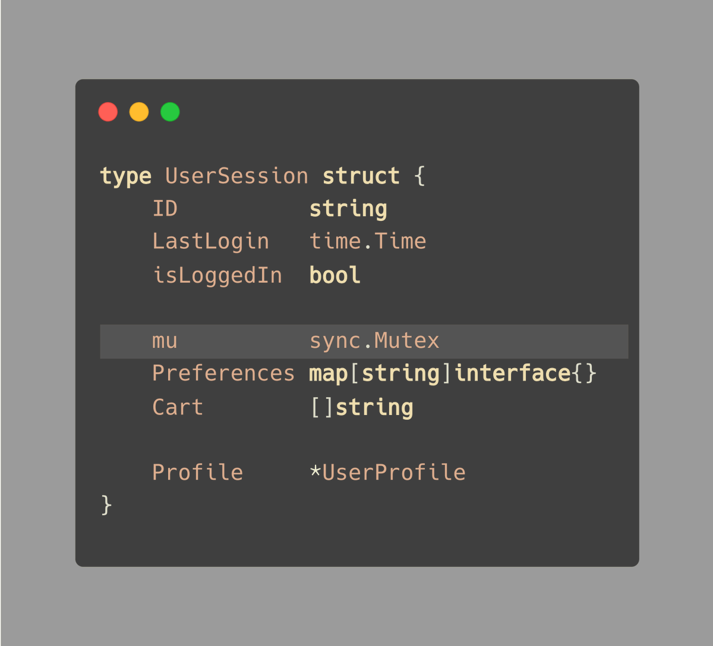
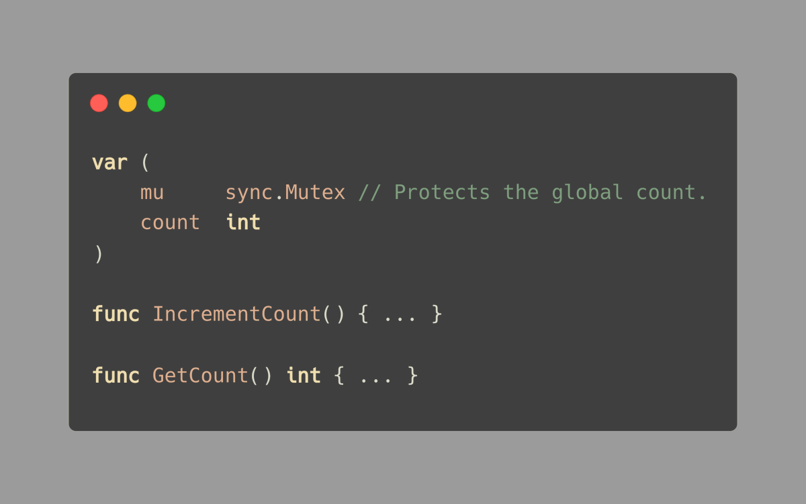

# Tip #58 将互斥锁放在保护的数据附近

> 原始链接：[ Golang Tip #58: Keep the mutex close to the data it's protecting](https://twitter.com/func25/status/1771846725164216709)

将 mutex 紧密放置在它所保护的对象旁边是一个很好的做法，这样做可以确保我们在完全知情的情况下锁定和解锁它。

让我们通过一些示例来看看这在实践中是如何工作的：

你认为互斥锁保护哪些字段？

它可能是 `Preferences`，也可能是 `Cart`、`Profile`...其他字段，或者甚至是全部。

关键是要安排好你的结构体，以便我们一目了然，无需深入查看代码。

> “但是你不是说要按照从大到小的顺序排列结构体的字段吗？”

你可能还记得 [Golang Tip #41：将结构体的字段按照从大到小的顺序排列](https://twitter.com/func25/status/1765371933053612110)。

然而，如果我们阅读 Tip #41 的最后一部分，我添加了一个关于易于阅读与优化之间权衡的关键说明。

因此，我通常会使用空行将相关字段分组，而不是严格遵循大小顺序。

**解决方案**

再次看看我们的示例，答案就在提示的标题中：“将互斥锁放在保护的数据附近”。

但是要用空行将它们与其他字段分开：

通过将互斥锁紧密放置在它们的上方，我们向团队（以及未来的自己）表明，这些字段 `Preferences` 和 `Cart` 需要以对多个 goroutine 安全的方式进行访问，使用互斥锁。

这个想法不仅适用于结构体。

它也可能适用于全局变量或只能一次调用的函数：

让我们不要担心关于全局变量的争论，这只是为了向你展示这个提示的含义.
