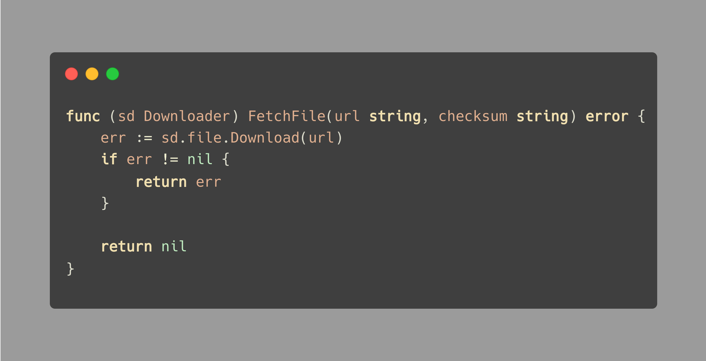
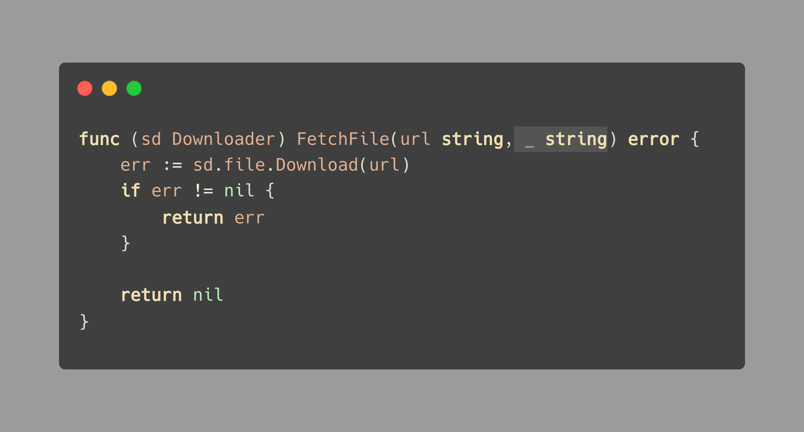
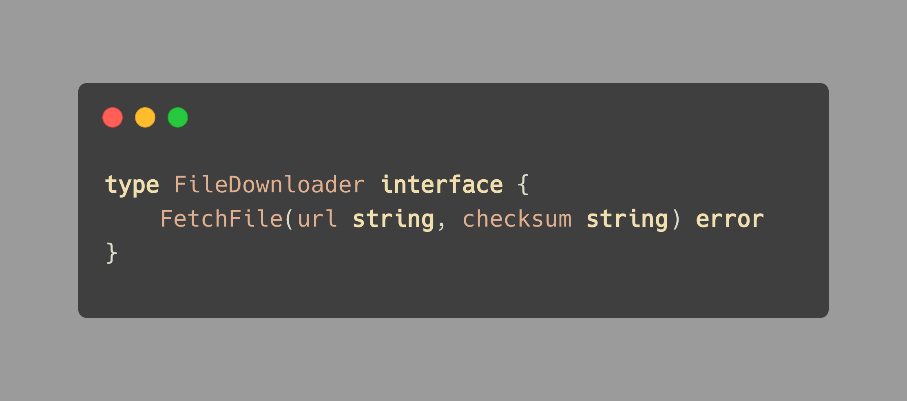

# Tip #59 如果不需要使用某个参数，删除它或是显式地忽略它

>  原始链接：[Golang Tip #59: If a parameter isn't needed, either drop it or ignore it on purpose](https://twitter.com/func25/status/1772225989143417031?t=nJCezW_QhRtqsWzSzHOMJw)
>

在我们深入讨论这个技巧之前，让我们剖析下方例子中出现的问题：

在这个例子中，`FetchFile` 函数的参数是 `URL` 和一个文件的校验和 `checksum`。然而，我们只使用了 `URL` 来获取文件，没有使用到 `checksum`。

这个例子的问题在于，**与局部变量不同，编译器不会告诉你是否忘记在函数中使用了一个参数**。

因此，尽管校验和 `checksum` 理应用于检查文件是否完整，我们还是无法确定 `checksum` 是被意外遗漏了，还是被有意地省略了。

**解决方法**

我们有两种处理方式：

- 使用下划线 `_` 来故意忽略该参数。
- 删除未使用的参数。

让我们使用这个技巧来改进函数：

通过将 `checksum` 参数替换为下划线 `_`，可以清晰地表示我们是故意省略这个参数的。根据不同的需求，我们可以使用多个下划线 `_` 来省略多个参数。

> "为什么不直接删除这个参数呢？"

如前文所述，删除该参数是该问题的解决方法之一。

但是，有时我们必须遵循特定的模式，比如遵循接口定义或者特定的函数定义：

当然，如果在参数列表中使用了过多的下划线 `_`，这可能意味着我们的设计本身就存在着问题。
