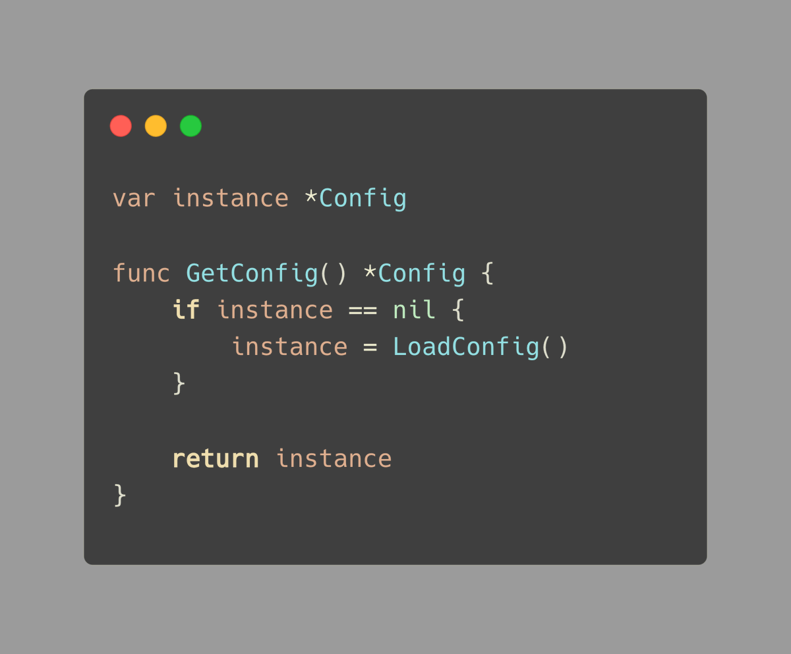
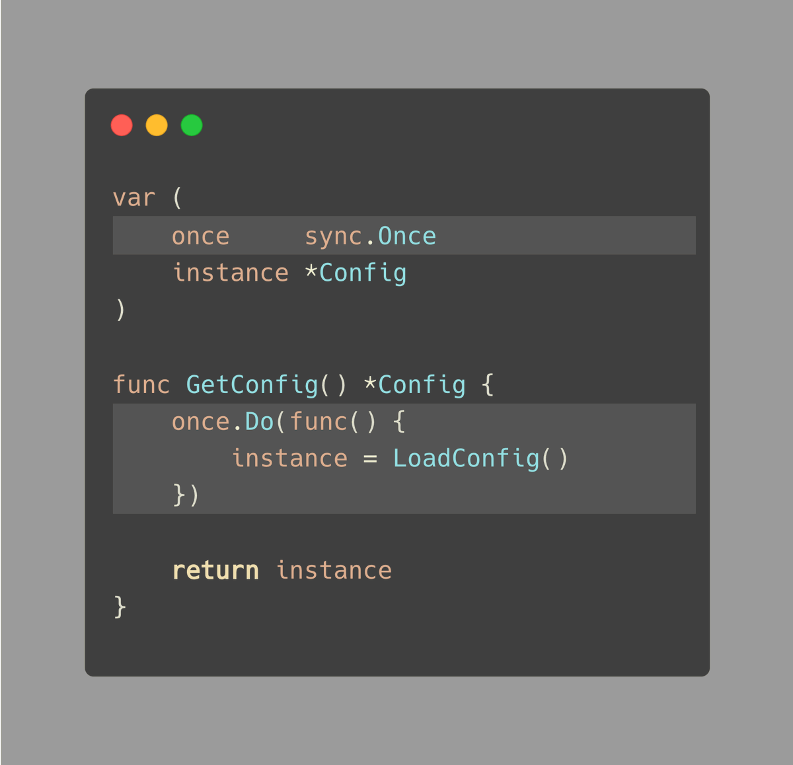
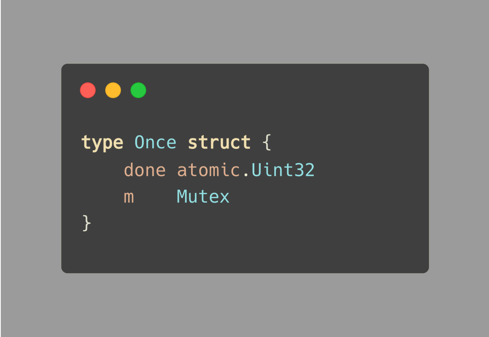
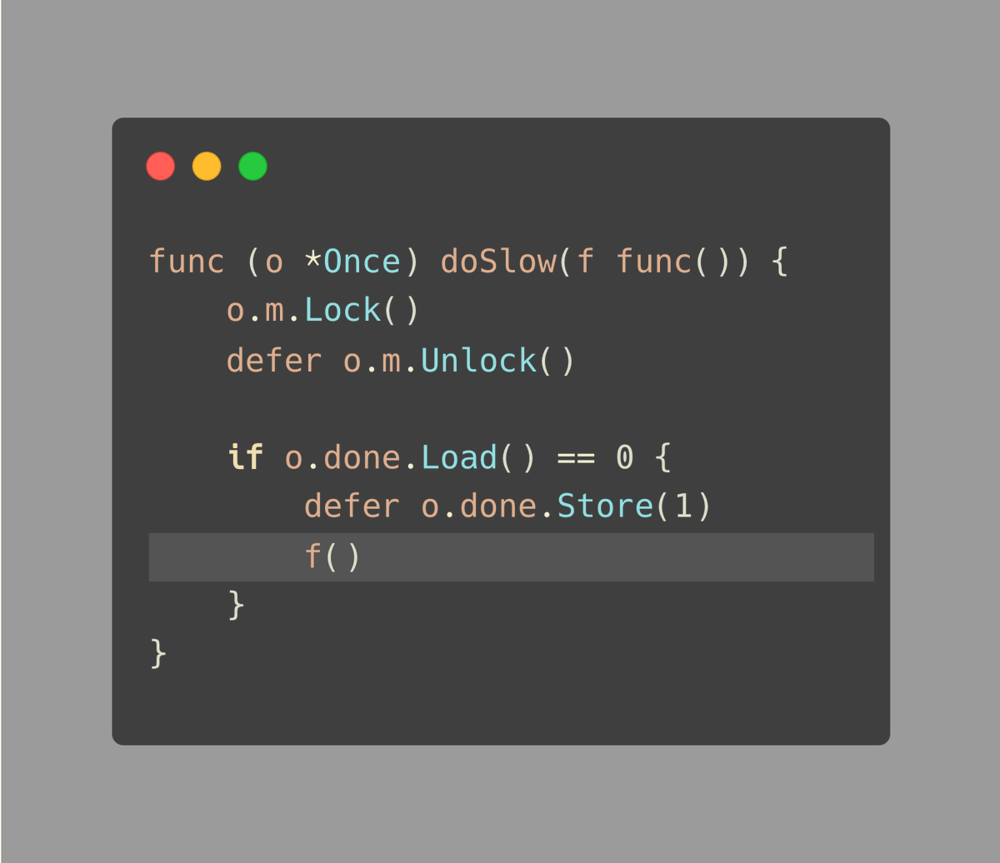

# Tip #60 `sync.Once` 是执行单次操作的最佳方式

> 原始链接：[Golang Tip #60: sync.Once is the best way to do things once](https://twitter.com/func25/status/1772587758114255322)

当我们处理单例时,这种解决方案是很常见的。有时单例会带来问题,但在某些情况下,它们是可以接受的。我们将讨论:

- 问题所在
- 如何修复
- 一种误解
- `sync.Once` 实际工作方式

假设我们有一个配置对象,需要在第一次被调用时进行一次设置,之后就可以共享使用。下面是一种简单的实现方式:


但是,当同时发生很多事情时,这种方式存在问题。如果在配置尚未设置时,许多 goroutine 试图同时获取配置,我们可能会多次执行 `LoadConfig()`。这并不是我们想要的。现在,让我们看看 `sync.Once` 是如何提供帮助的:


我们创建一个设置配置并将其传递给 `once.Do(f)` 的函数。即使有很多 goroutine 同时调用 `GetConfig()`,`sync.Once` 也能确保我们传递给 `.Do(..)` 的设置函数只运行一次。

**`sync.Once` 不能被重复使用**

关键是,如果我们试图再次使用 `sync.Once`,并传递另一个函数,它将不起作用。就像这样:

```go
o .Do(f1)
o .Do(f2)
```

第二个函数 `f2` 将被忽略,尽管它与 `f1` 不同。

**它是如何工作的?**

一个 `sync.Once` 会跟踪两件事:

- 一个原子计数器(或标志),有 `0` 和 `1` 两个值。
- 一个用于保护慢路径的互斥锁。

我们将稍后讨论所谓的快路径和慢路径,但先让我们看看 `sync.Once` 是如何构建的:


**快速路径**

当调用 `Do(f)` 时，它首先查看原子计数器。如果计数器为 `0`，则表示函数尚未执行。

这个快速通道的存在是为了当函数已经执行过时，后续的调用可以快速跳过并无需等待。

**慢速路径**
若计数器不为 `0`，则会触发慢速路径。`sync.Once` 会进入慢速模式并调用 `doSlow(f)`：


> 译者注：这里作者说错了，计数器为 `0`（`o.done.Load() == 0`）才会进入慢速路径

- `o.m.Lock()`：通过互斥锁确保同一时间只有一个 goroutine 能够执行接下来的步骤。
- `o.done.Load() == 0`：获得锁之后，再次检查计数器以确保在此期间没有其他 goroutine 抢先执行。
- `o.done.Store(1)`：为了确保我们知道函数已完成，在函数执行完毕后更新计数器。

> “为什么要设置快速路径和慢速路径？”

我们采用快速路径和慢速路径是因为我们希望建立既能尽可能快速又能必要时确保安全的机制。

慢速路径仅仅是用于初始化阶段，这个阶段很短暂。一旦初始化完成，每次调用 `.Do` 都会变得很快，这对长远性能而言是有益的。
