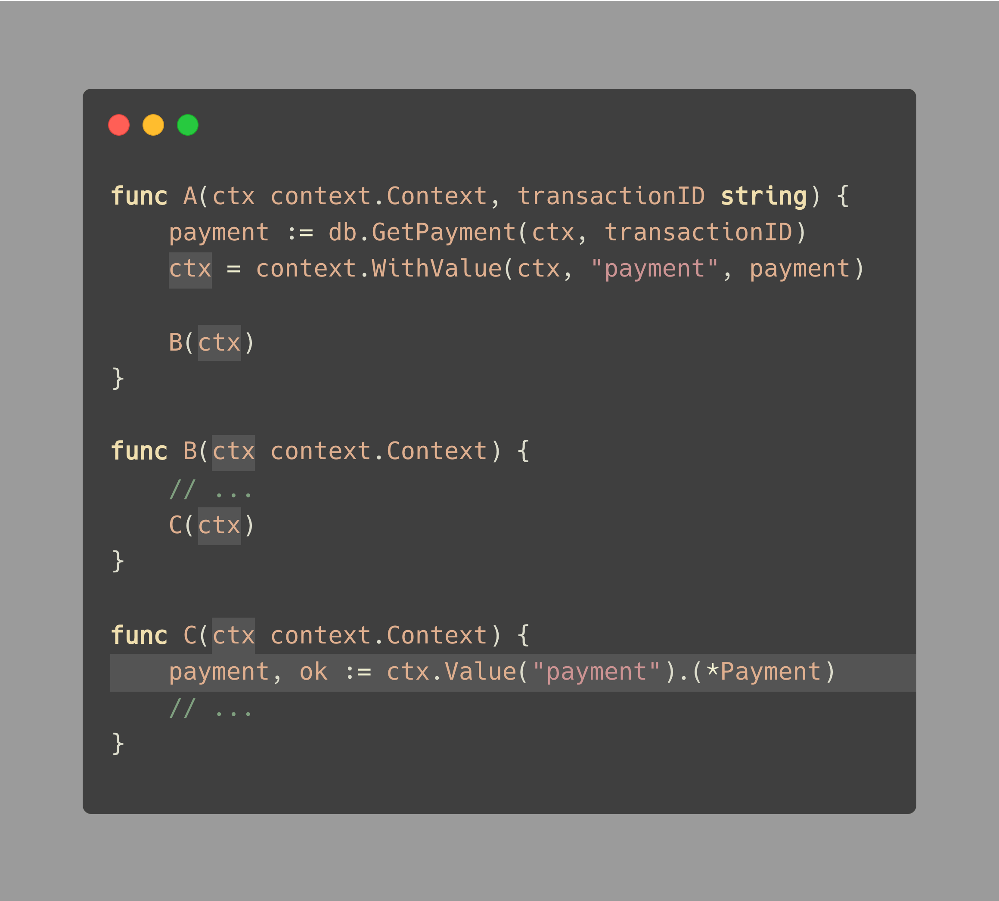

# Tip #62 context.Value 不是我们的朋友

> 原始链接：[Golang Tip #62: context.Value is not our friend](https://twitter.com/func25/status/1773343310465388571)

让我们谈谈 Go 中的一个糟糕模式，特别是对于那些刚接触 Go 语言的人（包括我自己）。

随着我们的 Go 应用程序变得越来越大，我们经常发现自己需要在多个函数之间共享数据：

如图中示例，函数 `A` 可能会从数据库中获取付款记录 `payment` 并将其添加到上下文 `context` 中，然后经过多次调用传递后，才在函数 `C` 中被读取使用。

这看起来很好，因为：

- 它让我们跳过将数据传递给不需要它的函数（例如函数 `B`）的步骤。

- 它允许我们在 `context` 中存储和读取所有需要的数据。

- 无需添加额外的函数参数。

> _“为什么不直接从函数 `A` 调用函数 `C` ？”_

存在很多场景会导致链式调用；例如，函数 `C` 是函数 `B` 中逻辑的一部分，需要函数 `B` 中的一些数据做为参数。

**那么使用 `context` 传递数据的问题出在哪里呢？**

以下就是我们遇到的一些问题：

- 我们放弃了 Go 在编译期间提供的类型检查安全性。

- 我们将数据放入黑盒中并希望稍后再获取它，但一周过后你可能就真的要像瞎子那样的去黑盒中搜索它了。

- 放入 `context` 中会使得 `payment` 数据看似是可选的，然而实际上它很重要。

在我看来，使用 `ctx.Value` 最大的问题是它太隐式了。数据被隐藏在 `context` 中，没有任何清晰的跟踪。

使用隐式可能不是一个坏主意，但却很难成为一个好主意。

...

**所以，我们什么时候应该使用 `context.Value()`？**

我建议尽可能的避免它。然而，Go 官方文档确实提到它对于 _“跨 API 边界 和 进程之间 传递 请求相关的值”_ 很有用。

所以您可能会考虑使用 context 来跟踪与请求相关的特定数据，例如：

- 开始时间
- 调用者的 IP
- `Trace` 和 `span` ID
- 被调用的 HTTP 路由
- ...

> _“`payment` 不是请求相关数据的一部分吗？"_

很明显，我们的函数无需读取请求体即可处理 `payment`。如果调用链中的大多数函数都需要 `payment` 数据，那么**显式**传递它会更好。

综上，我会避免在上下文中传递业务数据。
