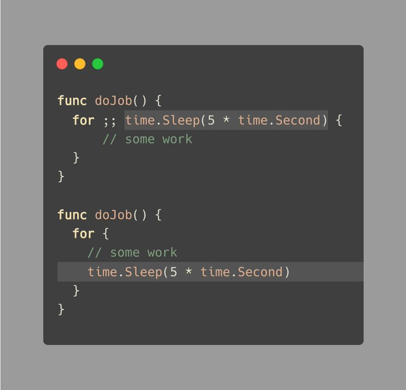
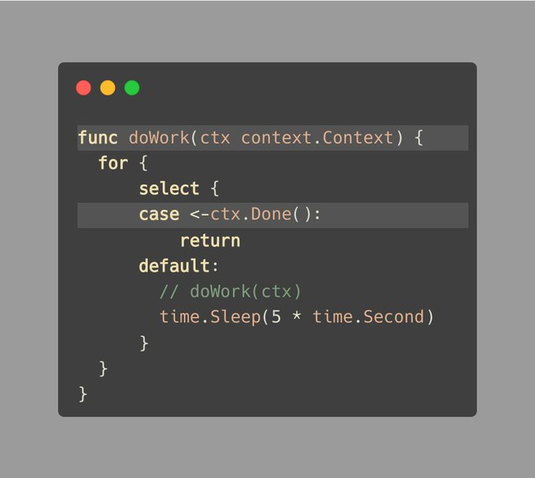
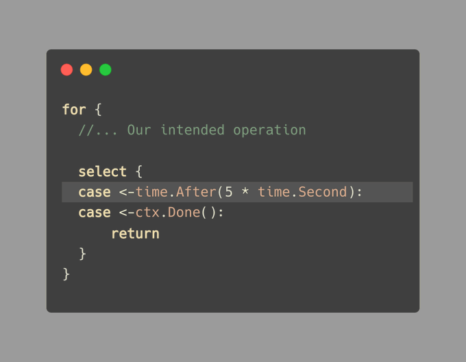
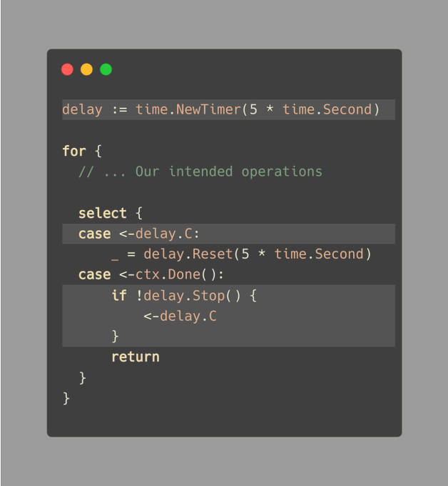

# Tip #63 避免使用time.Sleep()，它不能被context感知且无法被中断

>  原始链接：[ Golang Tip Tip #63: Avoid time.Sleep(), it's not context-aware and can't be interrupted.](https://twitter.com/func25/status/1773701845267153348)
>

使用 `time.Sleep` 可能看起来很有用，但它不能被context 感知，也无法被中断。

例如，如果我们的应用程序正在关闭，我们无法向正在休眠的函数发送信号。一旦它醒来，它会开始执行一些逻辑，但在工作时可能会被中断。

我自己也犯过这个错误，并将其作为学习的一点：

这些循环执行一些工作，然后使用 `time.Sleep` 暂停 5 秒钟，然后继续执行。

但是，这些循环无法通过context cancel来停止，如果我们需要快速停止一切，这是一个问题。

让我们传递context以使我们的工作考虑到context cancel：

这样做更好一些；虽然有点冗长，但我们的工作现在尊重上下文，例如：

- 1. -> doWork -> sleep -> shutdown -> ctx.Done() -> 结束。
- 2. -> doWork -> shutdown -> sleep -> ctx.Done() -> 结束。

（我们可以将 `doWork(ctx)` 放在 `for` 循环的正下方，以减少嵌套。）

但是，我们仍然需要等待 5 秒钟，或者根据作业延迟的情况可能更长。

**使用time包作为信号**

现在，我们正在讨论的解决方案使用了time包，但有一些微妙之处。

第一个修复涉及 `time.After`，在循环中如下所示：

这种方法简单而直接，但并不完美。

- 我们每次都在分配一个新的channel。
- Go 社区指出，`time.After` 可能会导致短期内存泄漏。

如果我们的函数在倒计时之前因为 `ctx.Done()` 而结束，那么 `time.After` 将一直存在，直到时间到期。

第二个修复可能更冗长，但旨在解决这个问题：

我们设置了一个计时器，当它到期时，我们重新启动它。

当context完成时，重要的是我们停止计时器以避免泄漏，可以使用与上面相同的解决方案，或者使用 `defer delay.Stop()`。

**最后的解决方案并不完美**

将我们的工作直接放在 `for` 循环下面可以减少代码的嵌套。但这并不能确保计时器第一次就是正确的。

您可能希望将我们预期的逻辑放在 `'case <- delay.C'` 下面。
