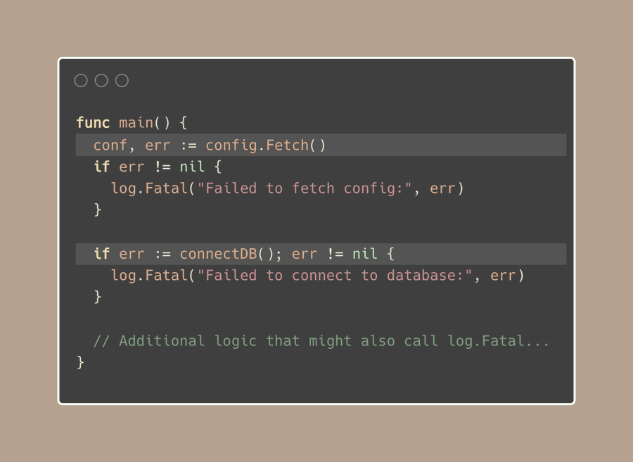
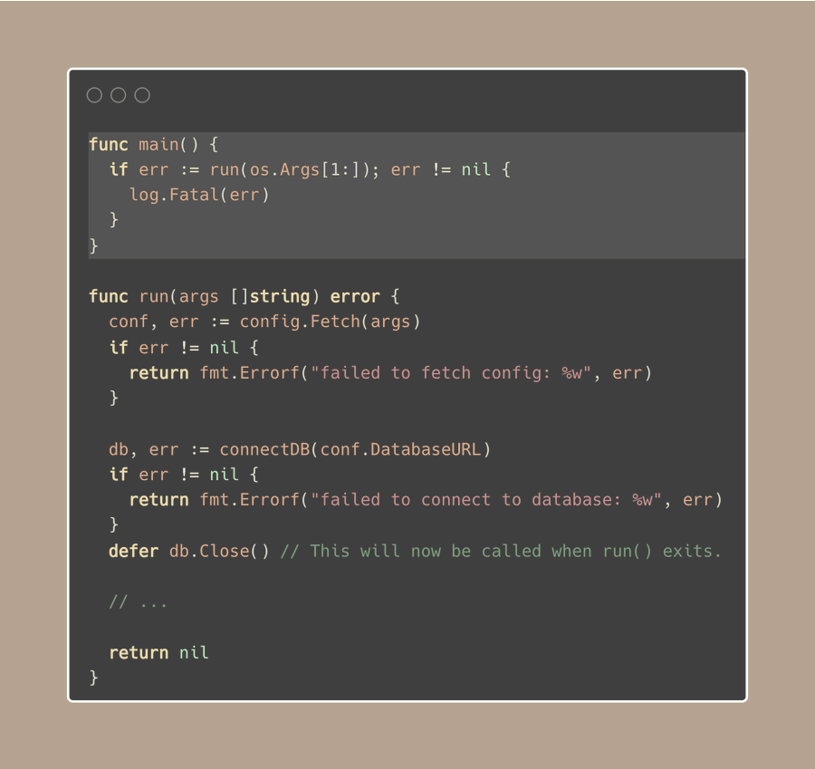

# Tip #64 让main()函数更清晰并且易于测试

>  原始链接：[Golang Tip #64: Make main() clean and testable](https://twitter.com/func25/status/1774789214498062751)
>

通常，我们会在 main() 函数中执行许多不同的任务，例如：

- 设置环境、JSON 配置
- 连接到数据库或 Redis 缓存
- 创建与消息队列的连接或与其他服务进行链接
- …

当出现问题时，我们通常会使用 log.Fatal 来立即停止程序（我自己通常避免使用 panic() 或 os.Exit(.)）：

如果您正在这样做，**这并不一定是一个坏的解决方案**，尤其是如果你不需要向我一样精细的控制。

但是，如果我们想要改进它呢？以下是一些目标：

- 立即使用log.Fatal停止程序，这意味着那些应该在代码完成后执行的函数（**defer**函数）都不会执行。

- 我希望能够更改参数（例如os.Args）或者修改安装程序的环境，以便在测试时覆盖到不同的场景。

- 我不想在我们遇到的每个错误都使用log.Fatal()

- 我想决定应用程序如何结束，是报错退出（退出代码 1）还是没有任何问题的退出（退出代码 0）。

此外，如果您还没有这样做，请查看[[Tip #43](./043.md)。

因此，让我们将所有的设置工作从 main 函数中移出：

现在，我们已经实现了所有的目标，main()函数现在只是替run函数把东西准备好。

我们可以用不同的参数集来测试“run函数”部分是如何独立工作的。

我们可能想要做的不仅仅只是返回一个错误（error），比如返回一个特定的退出代码（errCode）。这样，我们可以使用os.Exit和这个退出代码来结束程序。

我们让主函数来处理错误，这样我们就不用为每种情况写一个log了。