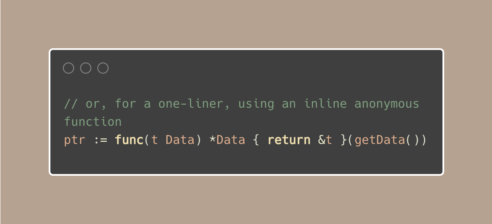
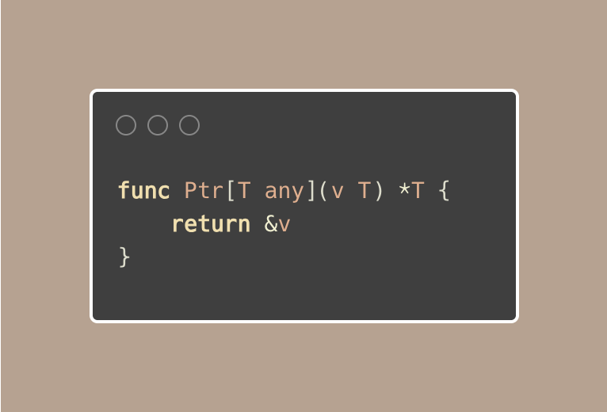
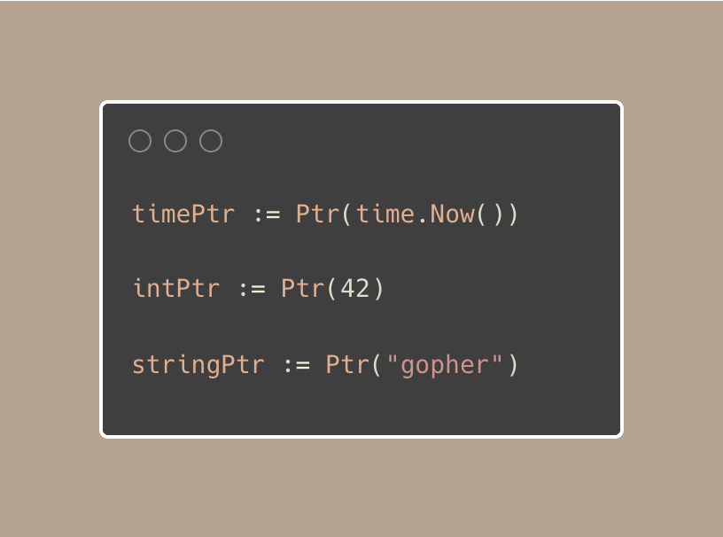

# Tip #65 使用泛型返回指针

> 原始链接：[Golang Tip #65: Returning Pointers Made Easy with Generics.](https://twitter.com/func25/status/1775141980835827875)

给那些经常需要指向某个值的指针的 Go 程序员的一个小提示。

以前，你可能做过类似的事情：

或者，你可能用一个小技巧在一行内完成所有操作：

这种方法很好用，但稍微有点长，特别是当你经常使用不同类型数据的时候。

现在，让我们看看使用泛型的更新、更简单的方法：

通过这个小函数，你可以为**任何类型的值**创建一个指针，而不必反复编写相同的代码。

只需将值传给 `Ptr`，就能得到所需的指针：

这样使你的代码更加简洁，避免了重复编写相同的代码。

你不再需要写单独的函数，也不需要为每种类型手动处理指针。这可以让你的代码保持简单，专注于重要的事情。
