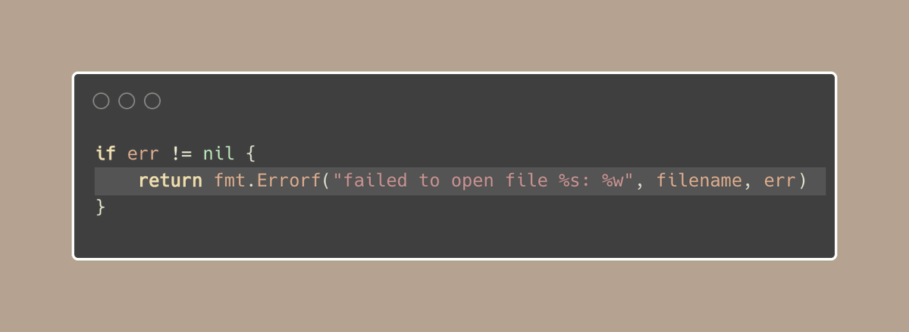
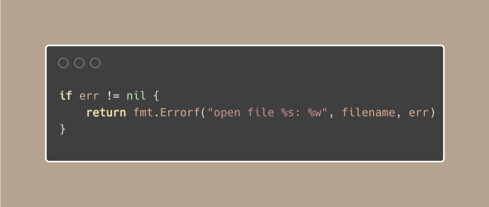

#  Tip #66 在fmt.Errorf中简化你的错误信息

>  原始链接：[Golang Tip #66: Simplify Your Error Messages in fmt.Errorf](https://twitter.com/func25/status/1775481695594291238)
>

在Go语言中，当我们处理错误时，提供足够的详细信息以便了解问题的具体原因是非常重要的。

之前有一个提示，即 Go Tips#38，专门讨论了这个问题。我们可以通过访问以下链接获取更多上下文信息：[tips#38](https://colobu.com/gotips/038.html)

（感谢 `@thedenisnikulin` 提供的额外建议，我们可以进一步改进错误处理方式。）

现在，我们应该熟悉使用 `fmt.Errorf` 函数以及 `%w` 来包裹（wrap）错误的做法：

通常情况下，我们可能会得到一个像这样的长错误消息：

"error while crawling: can't retrieve log: failed to open file server-logs.txt: file not exist.""

这个消息虽然清晰，但比实际所需冗长，因为它重复了一些诸如“error while”、“failed to”这样的短语，而我们知道我们在处理错误时，这些前置词汇是可以省略的。

因此，这里有一种更好的做法：

注意到不同之处了吗？

相比于冗长的消息，我们得到的是更简洁、更直接的内容：
"crawling: retrieve log: open file server-logs.txt: file not exist.""

这条消息仍然清楚地告诉你错误发生时正在进行的操作，并且更容易阅读。

因此，在Go语言中编写错误消息时，要保持简短，重点突出未能成功执行的动作。