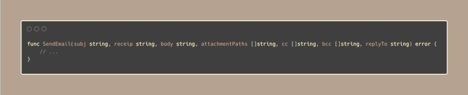

# Tip #67 如何处理长函数签名

>  原始链接：[ Golang Tip #67: How to deal with long function signatures](https://twitter.com/func25/status/1775910818116411508)
>

当你在 Go 中处理具有许多参数、长名称、接收器、多个返回结果的函数签名时，可能会遇到类似这样的情况：



```go
func SendEmail(subj string, receip string, body string, attachmentPaths []string, cc []string, bcc []string, replyTo string) error
```

在不破坏代码流程（从上到下）的情况下，有几种解决方法：

1. 长参数可能表明函数的功能超出了应有的范围，考虑将其拆分为较小的函数。
2. 如果任何参数是可选的，请考虑使用可选的结构体或变长函数。这一技术在我之前分享的tips中介绍过（[Tips#22](./022.md)）。
3. 如果参数是必需的，仍然可以将它们分组到一个结构体中并进行验证，必要时抛出错误。
4. 使用仍然清晰且描述准确的较短名称。
5. 具有相同类型的参数可以在类型前声明一次。

> “但我仍然想保留 4 或 5 个参数；我不想每次都创建一个新的结构体。”

**语义换行**

更清晰的解决方案是根据它们的语义关系将一组参数放在自己的一行上：


尽管由于多行而稍显冗长，但它使我们需要阅读的所有内容都在视线范围内。
