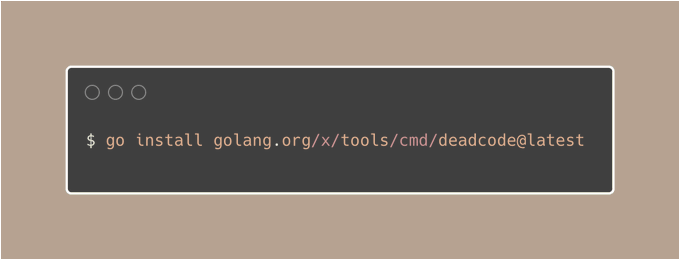
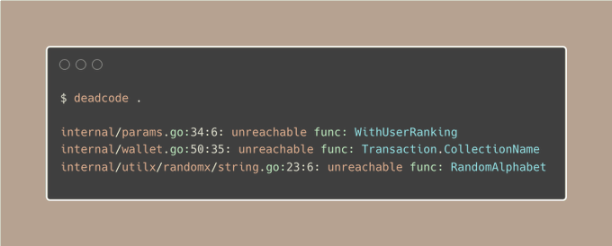

# Tip #68 使用deadcode工具来找到和删除无用的函数

>  原始链接：[ Golang Tip #68: Use the deadcode tool to find and remove unused functions](https://twitter.com/func25/status/1776223724913725925)
>

我们有时会有一些未使用的代码，我们称之为“死代码”。

这可能会让您在编写代码时感到困难，因为我们不确定是否可以删除它或更改它。

幸运的是，有一个名为`deadcode`的工具，可以帮助我们找到这些未使用的函数。我们可以使用以下命令进行安装：

我将其放在这里，以便您可以复制：`go install http://golang.org/x/tools/cmd/deadcode@latest`

然后，使用以下简短的命令运行它：

运行后，它将显示未使用的函数及其在代码中的位置。

如果您想知道为什么使用某个函数，我们可以使用 `-whylive` 标志，该工具将告诉我们该函数是如何连接其它代码。

根据我的经验，有时该工具可能不准确。因此，使用此工具来帮助您决定可以删除哪些代码。

其工作原理（简化）：

- 1. 该工具首先阅读所有代码，检查类型。

- 2. 它将 `main()` 和任何 `init()` 标识为起始点。

- 3. 从这些起始点开始，`deadcode` 查看直接调用的函数，它列出正在使用的函数。

- 4. 然后，它检查通过接口间接调用的函数。

- 5. 该工具跟踪转换为接口的任何类型，因为这些类型的方法可能会被间接调用。

- 6. 在工具完成分析后，不在此列表中的任何函数都被视为“死代码”，这意味着该函数与主路径运行的代码没有连接。

您可以在此处阅读有关查找和删除死代码的更多信息：[https://go.dev/blog/deadcode](https://go.dev/blog/deadcode)
