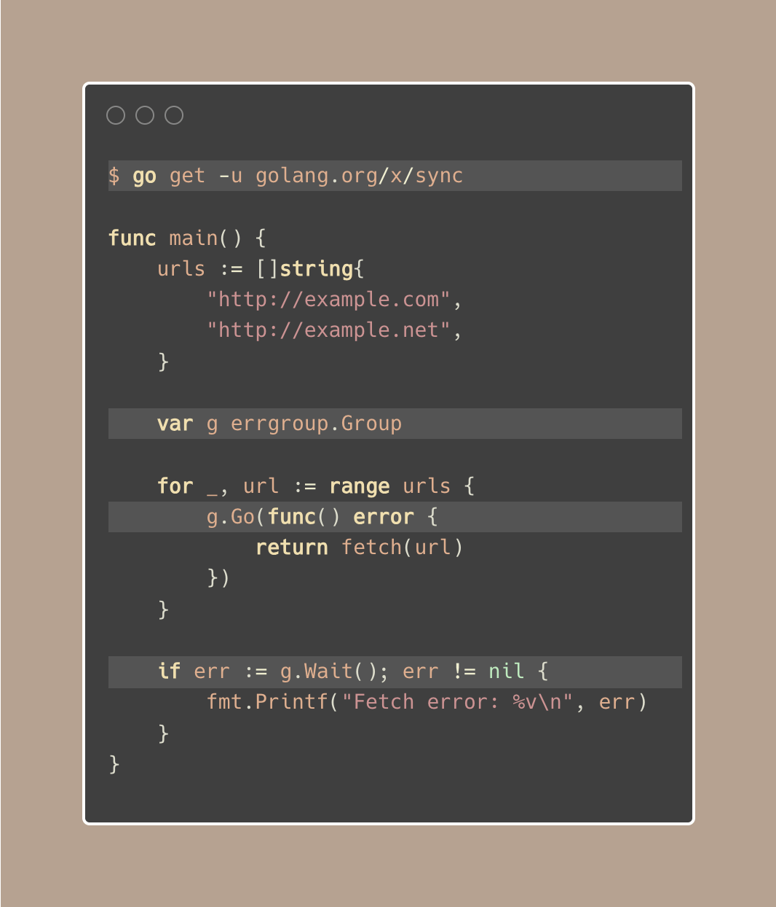
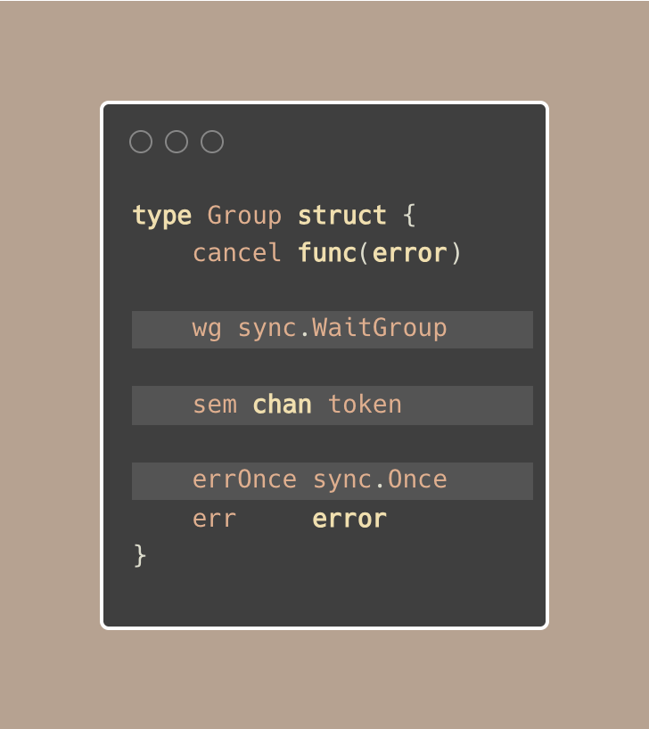
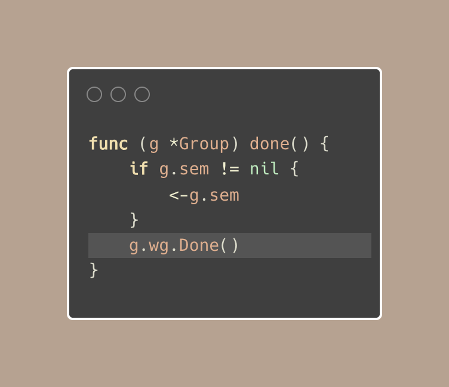

# Tip #69 通过errgrup管理多个goroutine

>  原始链接：[ Golang Tip #69: Manage multiple goroutines with errgroup](https://twitter.com/func25/status/1776555387254358509)
>

当我们处理一堆 goroutine 时，要处理错误并确保它们之间良好协同工作可能会有些困难。

您可能知道 `sync.WaitGroup`，对吗？但是有一个名为 **errgroup** 的包可以更轻松地处理这个问题：

在我们讨论的示例中，我们获取了 2 个页面，并使用 `g.Wait()`` 等待它们。

`errgroup` 是一个旨在帮助我们管理多个 goroutine 并处理它们在执行过程中抛出任何错误的工具。

这里有三个概念：

- 要并发运行任务，请使用 `g.Go()`` 启动一个 goroutine 并传递一个函数。
- 使用 `g.Wait()`` 等待所有 goroutine 完成，它会返回第一个发生的错误，而不是所有错误。
- `errgroup` 与context很搭配。

通过使用 `errgroup.WithContext()`，如果发生错误，context将被取消。

内部实现机制：

1. Group 结构使用了以下组合：

- `sync.WaitGroup` 用于等待所有 goroutine 完成
- `sync.Once` 确保以线程安全的方式捕获第一个错误
- 一个信号量 `chan` 用于控制同时运行的 goroutine 数量（我们甚至可以使用 `errg.SetLimit()` 设置限制）

2. `errg.done()` 是一个标记 goroutine 完成的辅助函数。

它会减少活动 goroutine 计数（如果设置了限制），并通知 WaitGroup 该 goroutine 已完成：

3. 它将错误处理集中在一个地方。
使用 `errOnce`，只记录第一个错误，然后触发停止并由 `Wait` 返回。

此外，使用 goroutine 并不总是最佳选择，特别是如果任务很快。有时，一个接一个地执行它们可能更好。
