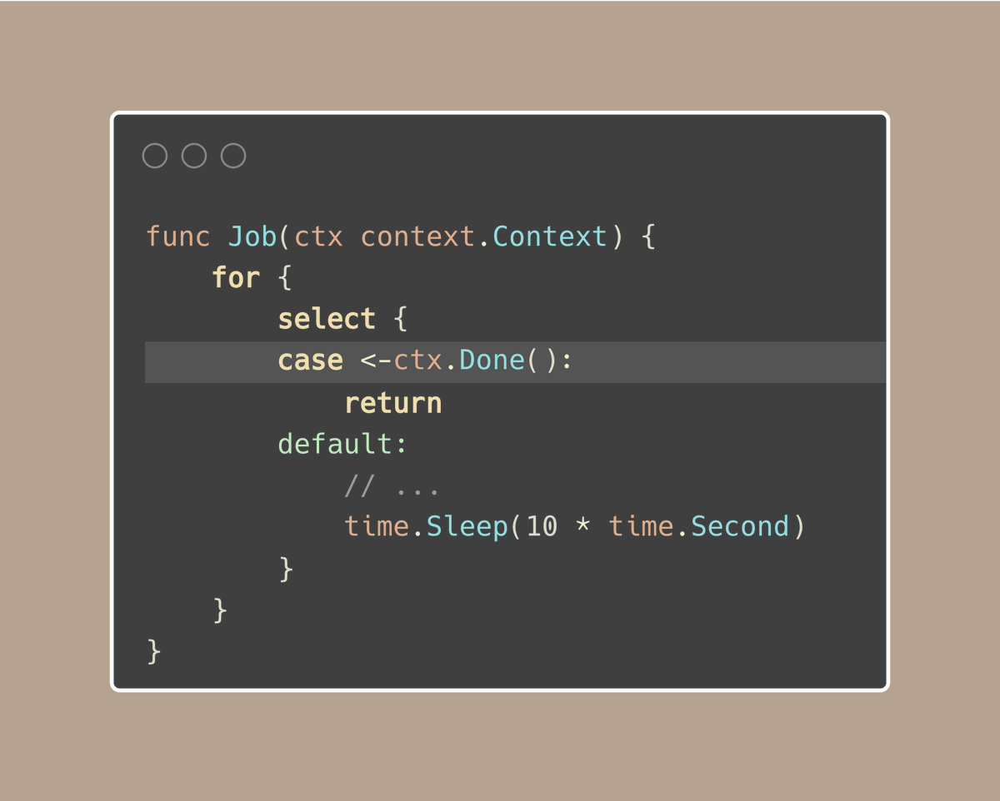
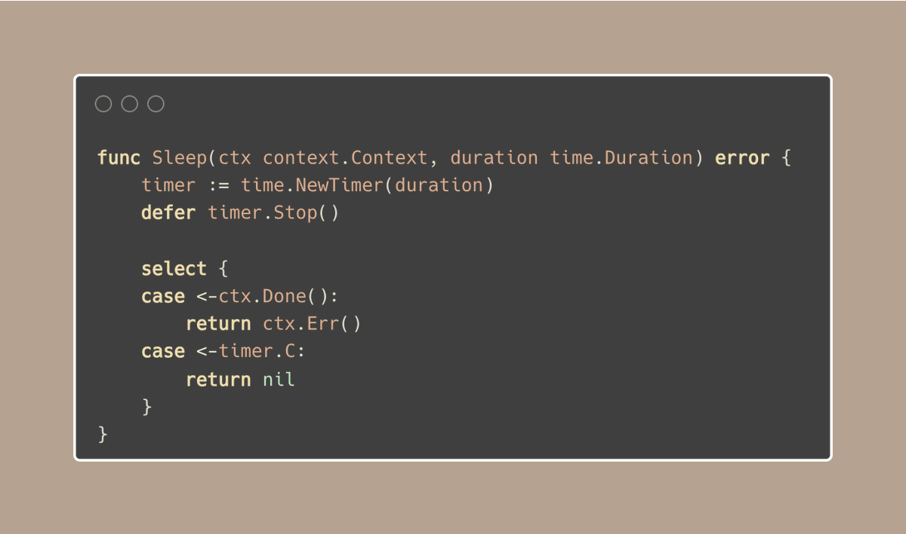
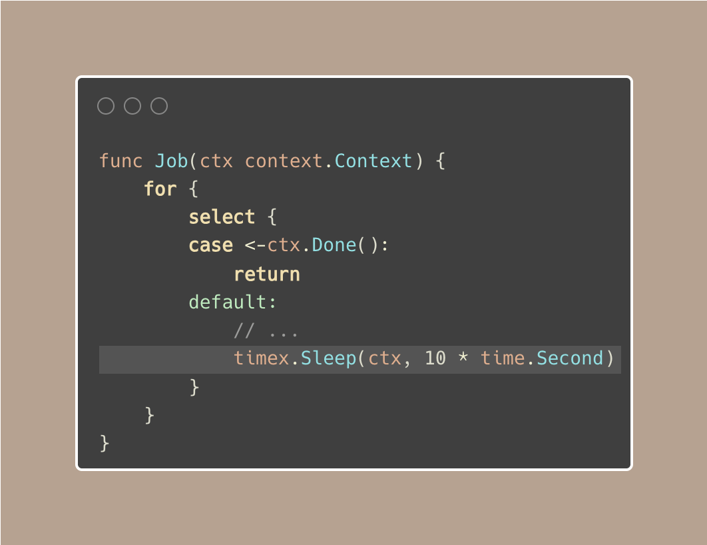
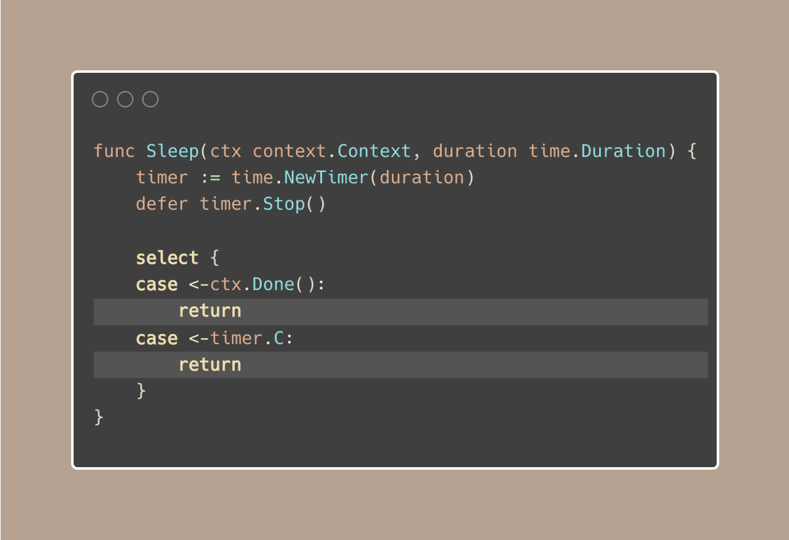

# Tip #70 实现一个感知context的sleep 函数

> 原始链接: [Golang Tip #70: Implement a context-aware sleep function.](https://twitter.com/func25/status/1776936187137229071)

**常规 time.Sleep ()不关心`context`。如果您将其设置为暂停 5 分钟，无论如何，它都会暂停整个过程.**

即使我们尝试在`context`中使用它，就像下面的例子一样，它也要等到 10 秒后才会停止：

> 我们在Tips #63 中讨论了解决方案：[避免 time.Sleep ()](https://twitter.com/func25/status/1774070336214253734) 

我们之前讨论的解决方案是可行的，但是一遍又一遍地写就有点麻烦了。

因此，让我们制作一个更加用户友好的版本，仍然让我们使用 Sleep() 函数，但尊重`context`被取消的时间。
我们可以创建一个“假”睡眠函数，如果`context`告诉它停止，它就会停止：

https://go.dev/play/p/FErMIDKoulb

这样，我们可以在 Go 中暂停代码，但如果有东西告诉`context`停止，Sleep将提前结束：

>“等等，你为什么不处理sleep()的错误呢？”

嗯，我们通常不需要。

大多数时候，当`context`被取消时，与sleep功能无关。这通常是因为程序中有一个更大的问题，其中包括sleep部分。

例如，如果代码中`sleep()`之后有步骤，并且它们被设置为监听上下文，那么如果`context`被取消，它们也会停止。

因此，让我们的sleep时间更短更加重要。

---

译者注： 评论区里面提到了一个 stackoverflow 的讨论，[How can I sleep with responsive context cancelation?](https://stackoverflow.com/questions/55135239/how-can-i-sleep-with-responsive-context-cancelation/77415571#77415571) 感兴趣的朋友可以看看。
