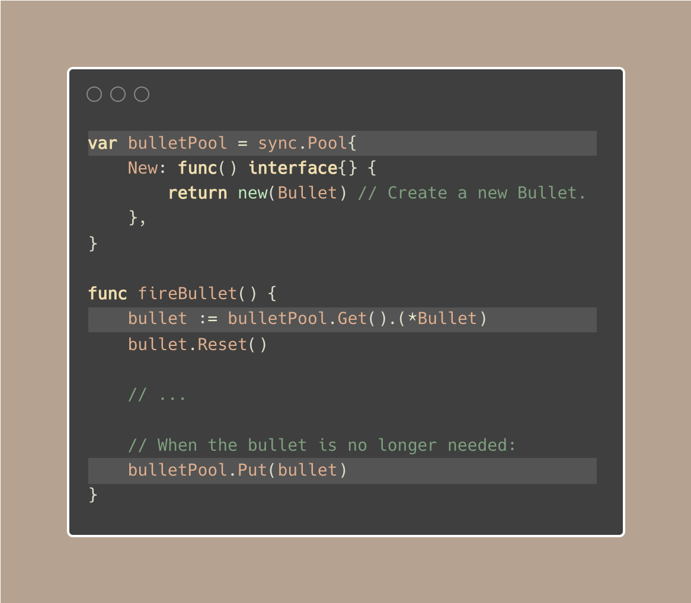
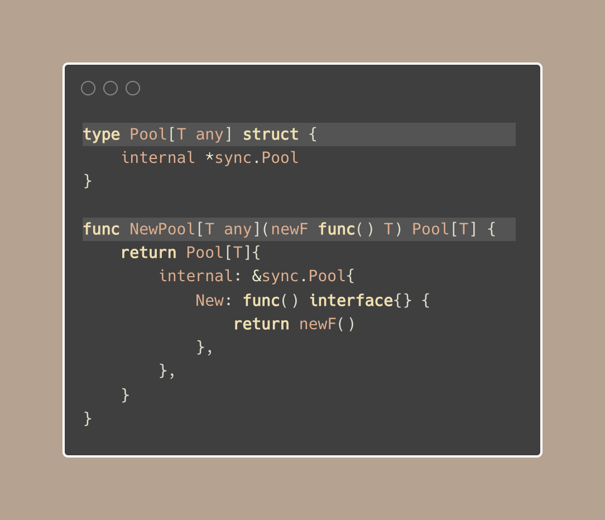
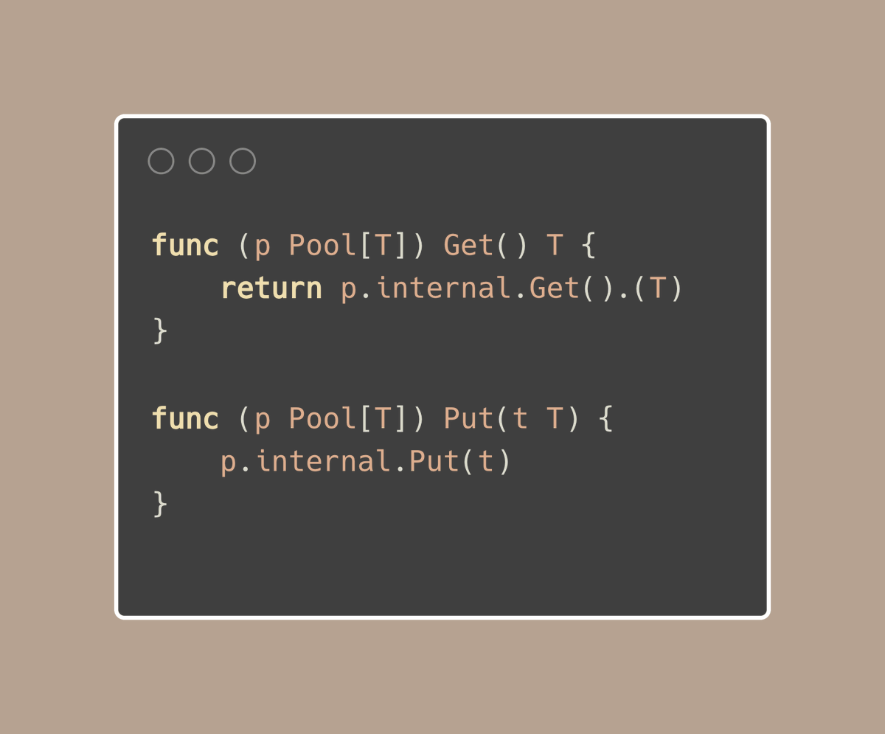

# Golang Tip #71: sync.Pool, make it typed-safe with generics.

## 什么是 sync.Pool?

> 原文链接：[Golang Tip #71: sync.Pool, make it typed-safe with generics.](https://twitter.com/func25/status/1777309778852859954)
>

在讲 sync.Pool 之前，对于那些不熟悉 sync.Pool的人来说，它是Go的标准库的一个特性，用于重用对象。

它可以减少内存分配的数量，有利于性能。想象一把每秒射出数百发子弹的枪，为每一发子弹在内存中分配新空间是很浪费的。

相反，你可以有大约100颗子弹容量的池子，并从池子中重复使用它们：

但是，需要注意以下几点：
- sync.Pool没有固定的大小，所以我们可以无限制地添加和检索条目
- 在我们把对象放回池子后，需要忘掉它，它可能会被清除或GC
- 对象可能有状态，我们应该在放入池中之前或之后从池中检索时清除或者重置它的状态

## 类型安全的池
现在让我们来讨论如何使 sync.Pool 变得类型安全。

我们上面使用空接口(interface{})来存储和检索条目。在类型安全的版本中，我们封装一下这个过程：

像上面那样，我们创建了一个与特定类型T相关联的池，但在内部仍然是用的 interface{}

这个方案来自于我们如何以类型安全的方式处理获取和放置数据：

我们像之前一样从池中取出数据，但是我们将接口转换为类型 T，而不进行错误检查。

> “我们为什么不检查转换过程中的错误呢？”

泛型已经为我们确保了类型，所以我们不需要担心转换失败。
sync.Pool 始终只包含类型 T 的实例，因此在正常情况下，断言 p.internal.Get(T) 不会引发 panic。

实例代码参见：https://go.dev/play/p/N3suxuK-yCp