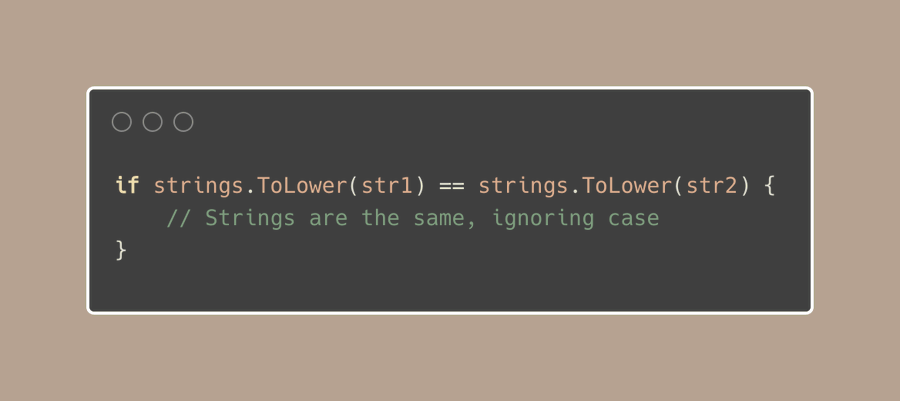
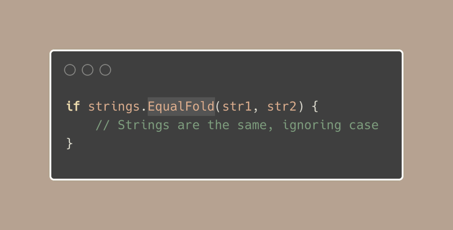
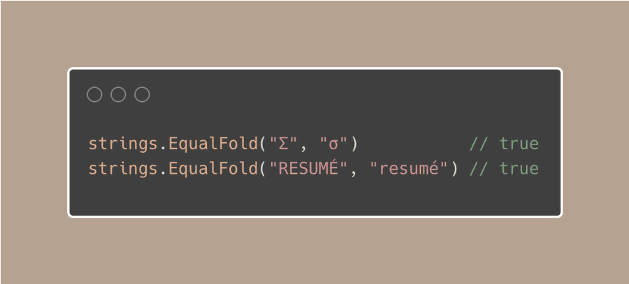

# Tip #72 使用strings.EqualFold进行忽略大小写的字符串比较

>  原始链接：[Golang Tip #72: Case-Insensitive string comparison with strings.EqualFold](https://twitter.com/func25/status/1777673942079283694)
>

当你需要比较字符串且不关心字母是大写还是小写时，你可能会想到：

- 使用strings.ToLower()将两个字符串都转换为小写；
- 或者使用strings.ToUpper()将它们都转换为大写。

然后检查它们是否相同：



但是，在 Go 中有一种更好的比较字符串的方法，而不必担心大小写。

就是使用strings.EqualFold：



我们选择strings.EqualFold函数不仅仅是因为它更短，而是因为它**专门**用于忽略大小写的比较，所以它会做的很好。

> “strings.EqualFold函数比使用ToLower后再进行比较更快吗？”

是的，这是在Go中忽略大小写比较字符串时的常用方法：


大小写折叠不仅仅只是将字母变成大写字母或者小写字母

它会小心处理 Unicode 的细节，确保对所有语言都有效，而不仅仅是简单的英语（或 ASCII？）字符：



简而言之，它会起始于：

**- 快速路径**：快速检查 ASCII 字符，逐个字符查看每个字符。

**- 慢速路径**：如果在任何字符串中发现 Unicode 字符，则切换到详细的 Unicode 比较。

请注意，你仍然可以在上面的示例中使用 strings.ToLower 或 strings.ToUpper，但这关系到速度和使你的代码易于阅读。

有时候即使strings.EqualFold也是不够用的，例如：

```go
s1 := "Resumé" // Normal 'é'
s2 := "resume\u0301" // 'e' 后跟一个组合重音符
```

在这种情况下，仅使用 strings.EqualFold 将不够，因为这些字符看起来相同但编码不同。

要正确比较这些字符串，您将需要其他方法来处理字符串,参考[golang.org/x/text/unicode...](http://golang.org/x/text/nocode/norm)