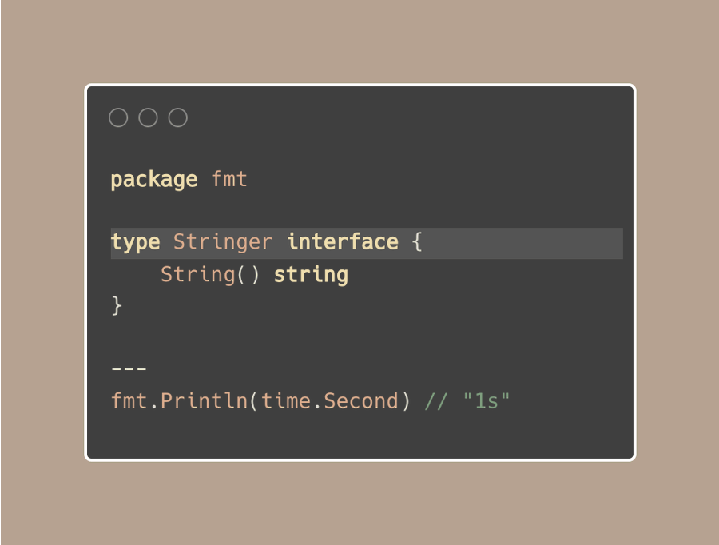
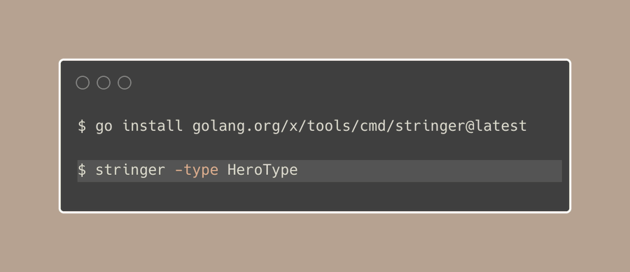
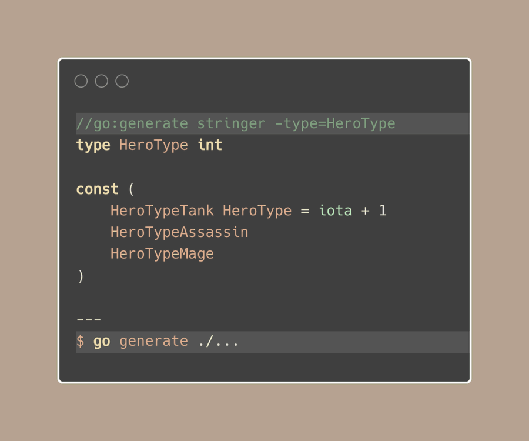

# Tip #73 用stringer工具给枚举类型实现String()方法

>  原始链接：[ Implement String() for enum with the stringer tool](https://twitter.com/func25/status/1778027410929410111)
>

你是否注意到，在你用Go语言打印中打印持续时间的时候，比如：fmt.Println(time.Second)，它显示为"1s"而不是"1000000000"，尽管 time.Duration的底层类型是int64类型。

这是因为time.Duration类型有一个String()方法，使其以一种更易于理解的方式打印出的来。

这个方法就是fmt.Stringer接口的一部分。



为了让我们自定义的类型也同样清晰，我们也可以添加一个String()方法。

对于枚举类型，我们通常使用数字，但是我们也希望打印出的内容更易于阅读。

我们可以写一个带有switch语句的函数来完成这件事。


然而这可能是一份额外的工作。

如果我们更改了枚举值并忘记去更新此函数，可能会导致问题。

幸运的是，Go有一个stringer工具，这是一个命令行工具，可以自动为我们创建String()方法：



> 我们是否需要为不同包中的每一个单独的类型都执行一次这个命令吗？

这就是"go generate"派上用场的地方了。

我们只需在我们的代码中添加一个特殊的注释"go generate"将调用 stringer工具，并为我们创建String()方法：



我们可以将这一行注释放在同一个包的任何地方，但我更喜欢将其放在对应的枚举类型上方。

有一些选项可以更改 String() 的工作方式：

**-trimprefix**：删除名称的前缀

如果我们有一个HeroTypeTank枚举值，它通常会显示为 "HeroTypeTank"。如果我们将 -trimprefix 设置为 "HeroType"，它将显示为 "Tank"。

```go
//go:generate stringer -type=HeroType -trimprefix=HeroType
```

**-linecomment**：设置一个**完全不同的枚举值名称**，只需要在枚举值后面的加上注释。

```go
HeroTypeAssassin // Something
//go:generate stringer -type=HeroType -linecomment
```