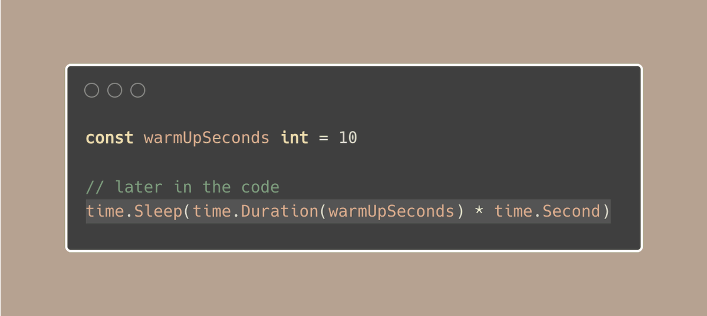
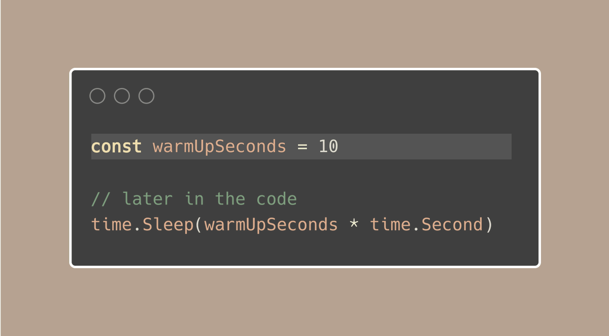
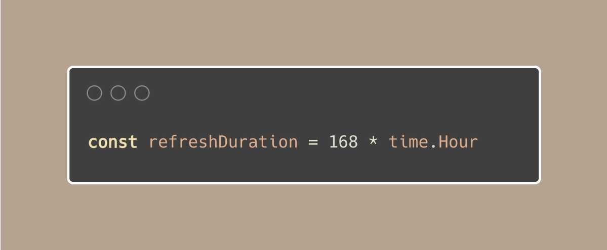
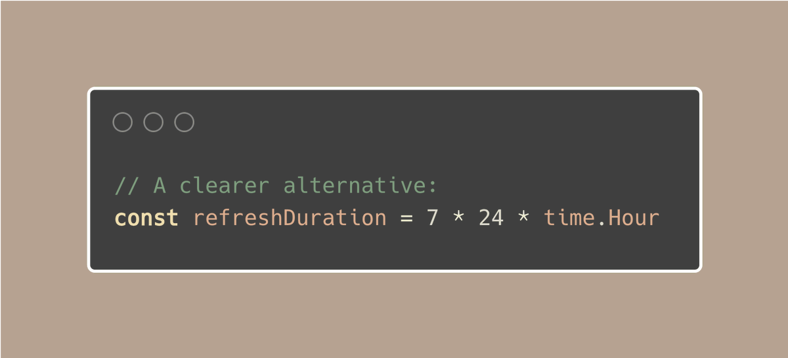

# Tip #74 使 `time.Duration` 清晰易懂

> 原始链接：[ Golang Tip #74: Make time.Duration clear and easy to understand](https://twitter.com/func25/status/1778408767300002050)

在编码里处理时间间隔的时候，你会经常使用 `time.Duration` 类型。一个常见的问题可能会让代码变得混乱，那就是当你使用秒时：

在 Go 中，这通常不是常规的做法，但是如果我们出于某种原因需要使用秒，我们可以使用一个无类型的常量：

这些常量很灵活，因为它们不会固定在某一种类型上，它们会适应于任何类型。

这里有一个例子，它是正确的，但可能更清晰一些：

看到 `168 * time.Hour` 可能不会立即告诉我们这是 1 周。为了让我们的表述更加清楚，我们可以这样设置：

现在，当有人阅读我们的代码时，他们可以立即看到 `refreshDuration` 是 1 周，而不必考虑这是多少小时。
