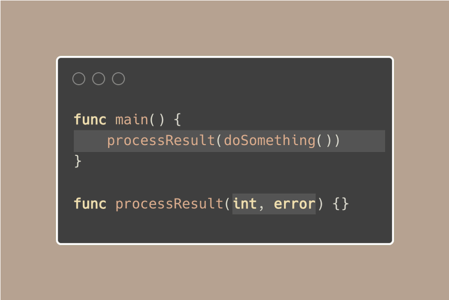
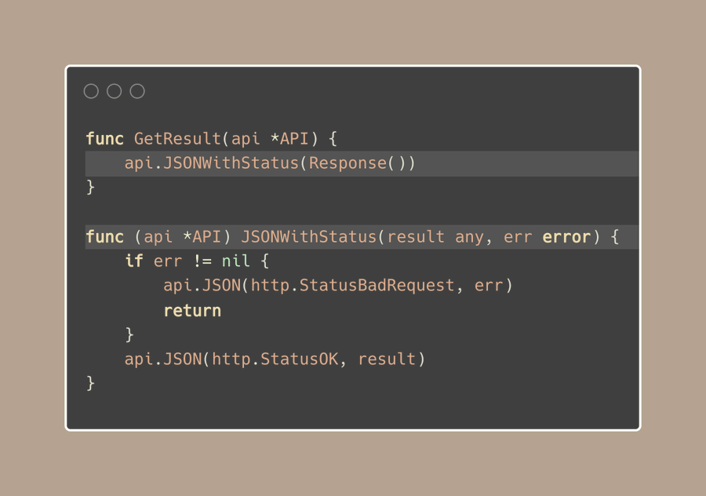

# Tip #76 函数调用的结果回传

>  原始链接：[Golang Tip #76: Result forwarding in function call](https://twitter.com/func25/status/1779128931586850890)
>

当我刚开始使用go语言的时候，我发现有一个概念比较棘手：函数调用结果的回传。

一个函数返回多个值是很常见的，通常是一个result附带一个error，看看我们在结尾是如何处理这个processResult(result)的：


如果processResult函数的传入参数正好适配doSomthing的返回值，我们可以将结果直接传递给processResult，这样看起来十分整洁。



现在这里有一个例子：我们获取一个result和一个error，并且我们需要基于此给客户端响应一个状态码。

通常情况下，你可能会看到很多controllers或者API层的函数都在做着同样的事情。

它们接收 (result, error) 这样的返回值，如果有错误的话会返回400状态码，如果没有错误就返回200状态码。


我们可以通过创造一个基于函数调用的标准方法来处理这些响应，来简化我们的代码，而不是在多个函数里重复的使用以上的模式。



这个技巧与我在之前提到的“must”函数结合使用时效果非常好。具体详见：[Golang Tip #44: Intentionally Stop with Must Functions](./044.md)

我还有一个小的通用的辅助的函数，如果没有error的时候它会返回结果，否则就会停止运行。

```go
func Must[T any](result T, err error) T { ... }
```