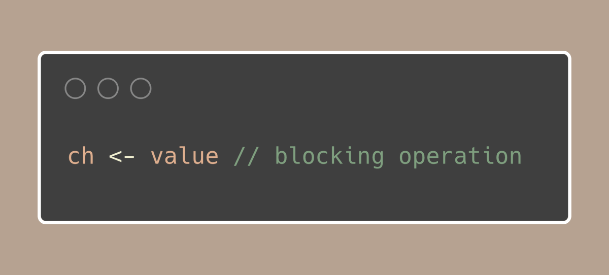

# Tip #78 非阻塞 channel 发送技巧

>  原始链接：https://twitter.com/func25/status/1780207297991782834 
>

当我们向channel发送数据时，通常会等待接收方准备好接收数据：

但有时我们并不想等待。例如，如果您学习了前面关于使用 semaphore 的小技巧，我们就可以使用**TryAcquire() bool** 函数，如果所有令牌都已被占用，它就会立即返回。

*如果您错过了上一条Tip*  请看 *[Tip #77: Buffered channels as semaphores to limit goroutine execution](https://colobu.com/gotips/077.html)*

以 [errgroup](https://github.com/golang/sync/tree/master/errgroup) 为例，其内部使用了简单的信号量机制来管理 goroutine 的数量。

现在，如果信号量已满，我们希望它在无法启动时立即返回 false，就像 `mutex.TryLock() `一样。

让我们看看 [errgroup](https://github.com/golang/sync/blob/14be23e5b48bec28285f8a694875175ecacfddb3/errgroup/errgroup.go#L93) 如何处理这个问题：

关注 if 条件中的 select{} 语句。通常，select{} 用于等待来自多个通道操作的值，但这里的使用方式很特别： 

- `case g.sem <- token{}:` 这一行试图向信号通道 `g.sem` 发送一个标记。如果有空格（意味着没有达到上限），则标记发送成功，这部分代码执行。

- `default:` 如果 `g.sem` 通道已满，则选择这种情况。

如果其他情况尚未准备就绪，选择语句中的默认情况会立即运行。

在这种情况下，它会返回**false**，通知我们函数没有启动新的 goroutine，因为我们已经达到了之前设置的活动 goroutine 的最大数量。

