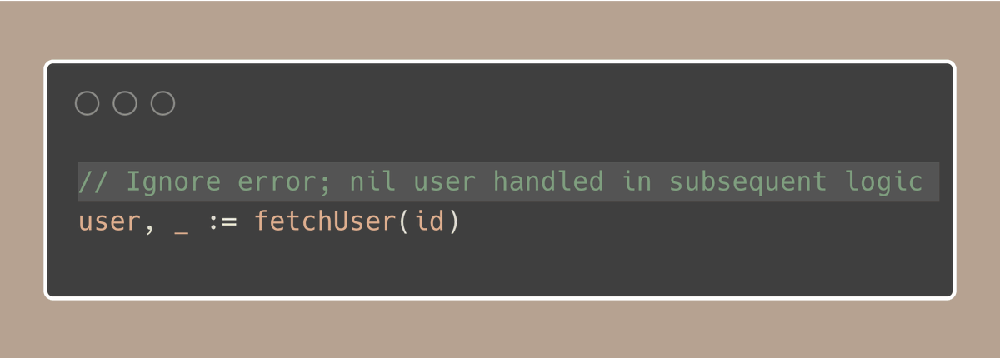
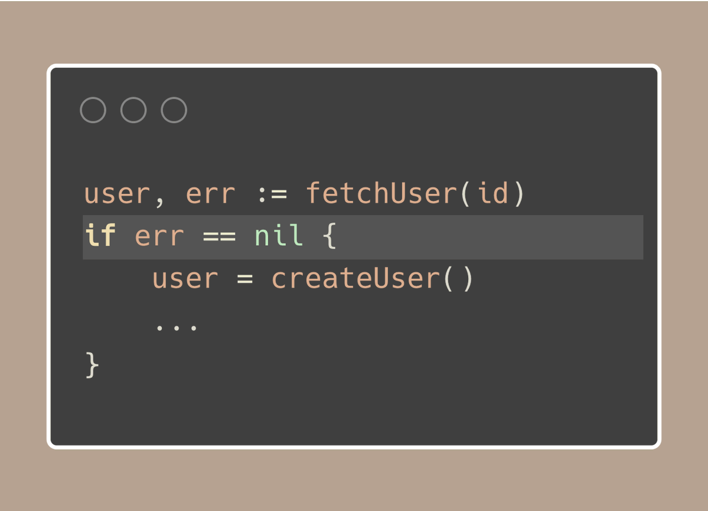

# Tip #79 如果做了不寻常的事，请说明原因

> 原始链接：[Golang Tip #79: If doing something unusual, comment why](https://twitter.com/func25/status/1784197311926808655)

我已经审查了一段时间的代码，并意识到最常见且最令人沮丧的问题之一是对不寻常代码的选择缺乏注释。

当我们使用 Go 语言足够长的时间后，我们明白大部分代码应该遵循常用的习惯用法和社区实践。

但是，有时我们需要打破这些规范，例如：

忽略错误或返回的结果，这行代码可能会让审查者或其他团队成员感到困惑或惊讶。

为什么忽略这个错误并不清楚。或许这个错误并不关键，即使没有有效的用户，功能也能继续执行，但为什么会这样呢？

以下是如何澄清这个问题的方法：

这条注释迅速告诉读者，忽略错误是一个故意的决定，因为后续代码可以适当地处理一个为 `nil` 的用户。

再次强调，不应该忽略错误；这只是一个例子。至少，应该记录下这个错误。

还有一个：

如果我们不突出显示那行不同寻常的代码，就很难看出哪里令人惊讶。

因此，这条注释不仅解释了为什么我们选择使用 `err == nil`，还通知了团队成员：“嘿，这是不寻常的代码，请看一下”。

这是不寻常的，并且很容易被忽视，因为不寻常的细节太细微了，不容易被发现。

因此，当你以不同的方式做事时，一定要加上注释。
