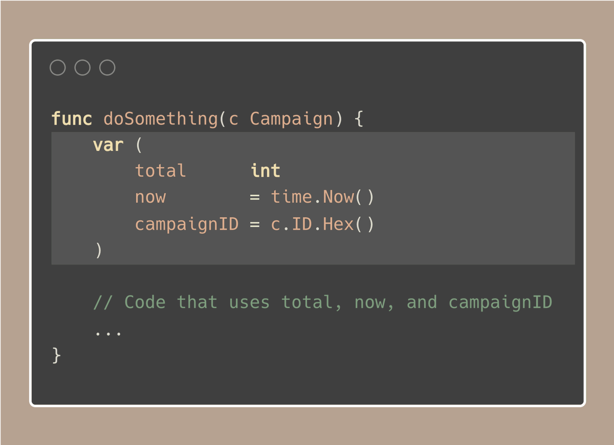
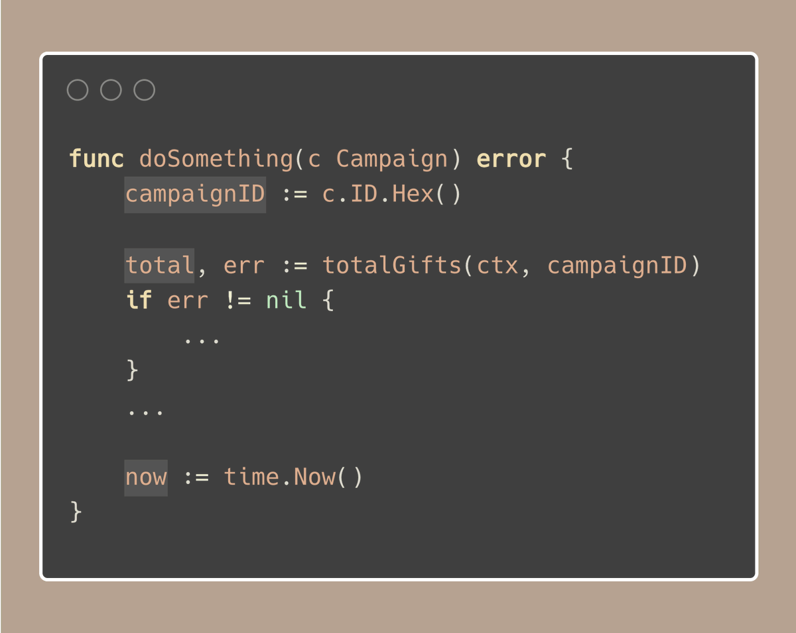

# Tip #80 在其使用位置附近声明变量

>  原始链接：[Golang Tip #80: Declare variables NEAR their usage](https://twitter.com/func25/status/1784941332668223956)
>

这是一个在使用Go语言一段时间后的常见错误。

人们常常将所有变量放在函数的顶部，更糟糕的是，他们还使用'var'关键字来声明变量。

虽然这样做看起来整洁或似乎是一种简单的方式来跟踪正在使用的变量，但实际上它会使代码更难阅读和维护。

以名为'total'的变量为例。如果它在函数开头就声明了，等到你在代码中看到它被使用时，你可能需要向上滚动才能想起它的用途。

理想情况下，你希望尽可能接近使用变量的地方来声明它们：

这样，当你看到每个变量时，就很清楚它的用途，这使得阅读和理解代码变得更加容易。

虽然偶尔有理由将变量放在顶部，但这并不常见。此外，使用'var'会使焦点转移到屏幕的右侧（嵌套），而这不是我们眼睛自然滚动的地方。