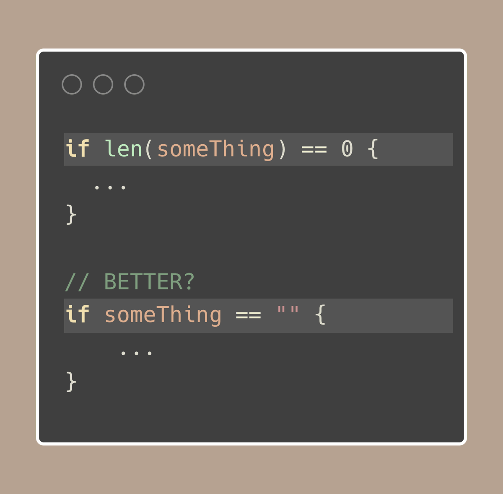

# Tip #81 在检查一个字符串是否为空时，推荐使用 `s != ""` 而不是 `len(s) == 0`

>  原始链接：[Golang Tip #81: To check if a string is empty, prefer s != "" over len(s) == 0](https://twitter.com/func25/status/1785609616472379539)
>

两种解决方案都是完全可以的，并且这两种技术在Go的标准库中都很常见。

> 但是它们有什么区别？为什么我们应该优先使用 `s != ""`？

使用 `len(...)` 适用于不同类型的对象，如**字符串**、**切片**和**map**，所以你不需要记住你正在处理什么类型。

但是，由于这种隐式的特性，它稍微有些不够清晰；在上述例子中，我们无法立刻看出 `something` 是一个字符串，对吧？

我们发现 `s != ""` 使得我们检查空字符串的意图变得显而易见，这可以让我们的代码更加易读。

最终，我们是否使用 `s != ""` 还是 `len(s) == 0` 可以取决于具体的情况或者只是你或你的团队更喜欢哪种方式。