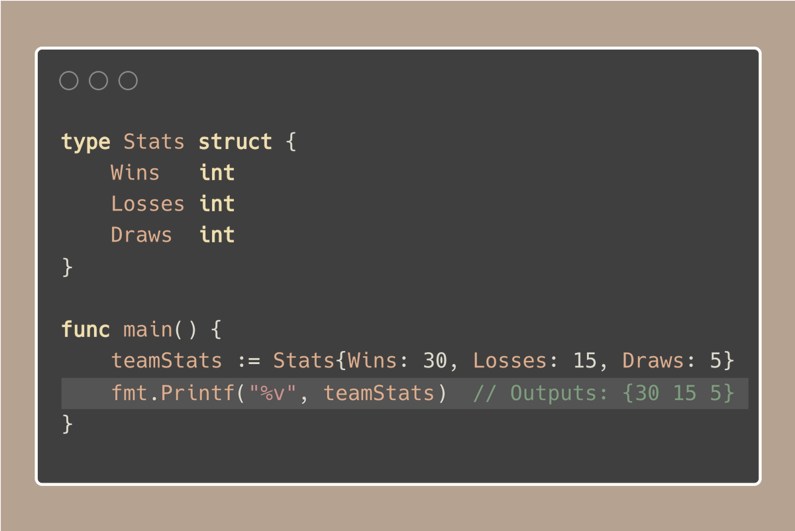
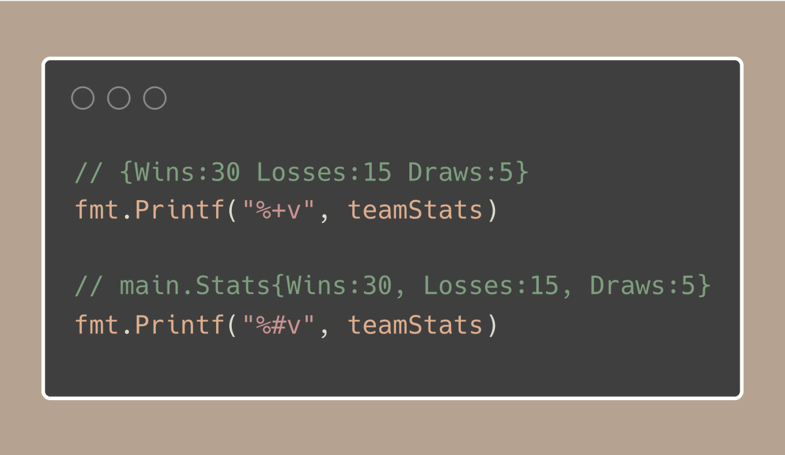
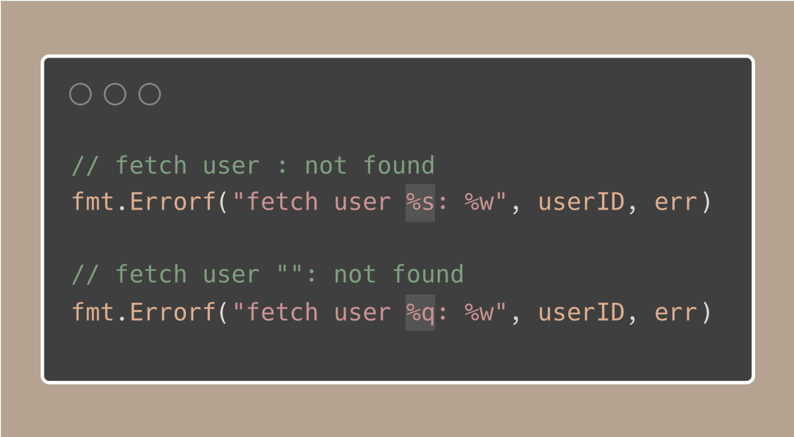

# Tip #82 使用`%+v`和`%q`来增强调试输出，而不是使用`%v`和`%s`

>  原始链接：[Golang Tip #82: Enhance Debug Output with %+v and %q Instead of %v and %s](https://twitter.com/func25/status/1786377258082746722)
>

当我们进行调试时，能够从日志中获得更清晰、更详细的输出对我们来说这会是一个巨大的帮助。

举一个常见的场景，你正在用`fmt.Println`快速检查一个结构体的状态：

这里输出 `{30 15 5}` 并不会立即告诉我们哪个数字代表胜利`(Wins)`，哪个代表失败`(Losses)`，或者哪个代表平局`(Draws)`。

除非你记得在结构体中定义的顺序。

但是，通过使用 `%+v` 和 `%#v`（它们确实是 `%v` 的变体），我们可以使输出更加具有信息量和易于理解：

- `%+v` 非常好，因为它在输出中直接包含了字段名，消除了每个值代表什么的任何混淆。
- `%#v` 更进一步，显示了包含包名和结构体类型的完整结构。这可能比你日常需要的细节更多，但在更复杂的场景中会非常有用。

> “%q 怎么样？”

`%q` 本质上是一个将字符串用引号括起来的快捷方式，而 `%s` 只是原样输出字符串。

这种区别在处理以下情况时特别有用：
- 可能是空的字符串
- 或者包含特殊字符或空格，这些字符不是立即可见的：

只要看一下使用每种格式化选项生成的日志，就会注意到当使用 `%q` 时，问题变得多么清晰？

> “但是有什么缺点呢？”

不过，有一点需要注意，那就是 `%q` 不会解释像 `\t` 或 `\n` 这样的转义字符，这可能会使字符串更难阅读。

（实际上，这可能非常有用，因为它会向你展示字符串中确切的内容，保留所有的特殊字符。）

